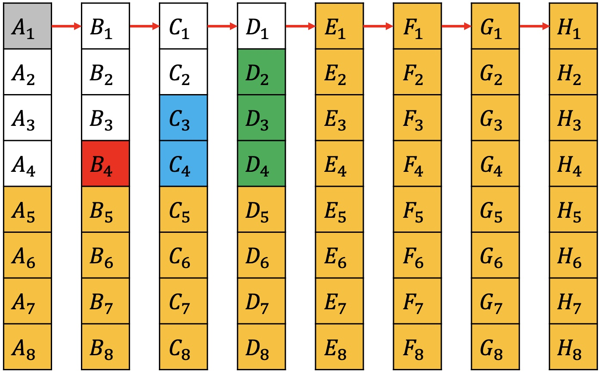

# 腾讯面试题：64匹马，8赛道，找出最快的4匹最少要几次?

### 1 故事起源
有64匹马，8条赛道，要找出最快的4匹马，最少要几次呢？

### 2 初步思考
很多同学可能第一反应就是，这个问题肯定不简单，应该有一些技巧，但技巧是啥呢，又一时想不出来。

其实呢，先别想得太复杂了，比如我现在就问你一个问题，有没有可能存在有一匹不用跑？  
答案当然是不行。

### 3 分析 
那也就是每一匹都得先跑一次，64匹，8个赛道，那就先分8组跑8次。

每一组都会得到8匹的相对速度，也就是在同一组内的名次。

为了方便描述，我们用编号来表示。如A组里面的名次分别用$$A_1,A_2,\cdots,A_8$$来表示。

因为我们只需要找出最快的4匹，那么$$A_5,A_6,A_7,A_8$$肯定不属于最快的4匹，同理把每一组的后4名先排除。

现在每一组内都有相对名次，但不同的组间是不知道的。如果把A组和B组放一起，下面的情况都可能存在。

因为是要找最快的，所以选择每组的第一名再出来跑一次，这样落后的第一名所在的整组都可以排除。  为了描述方便，把最快到最慢的第一名所在的组依次重新命名为A，B...H组。

组间的第一名有了名次关系，可以发现$$D_2,D_3,D_4$$一定不属于前4名，因为$$A_1,B_1,C_1,D_1$$都在他们前面。同理可排除$$C_3,C_4,B_4$$。同时$$A_1$$是最快的，一定属于前4。那接下来只需在剩下的9匹中找出前3。

除去$$A_4$$，其余8匹跑一次。如果$$A_3$$在第3名或者更后，那说明已经选出了前3名，$$A_4$$也不用再跑了，否则再取前3和$$A_4$$一起跑一次，即可得结果。

最多11次一定可以选出最快的4匹。

### 4 总结
这种思维题，其实是很难直接就想清楚整个过程。可以先想得简单一点，往下推一步再看，逐步推进就可以引导出正确的结果了。

如果喜欢小K的文章，请点个关注，分享给更多的人，小K将持续更新，谢谢啦!

---
**扫描下方二维码关注公众号，第一时间获取更新信息！**  

 