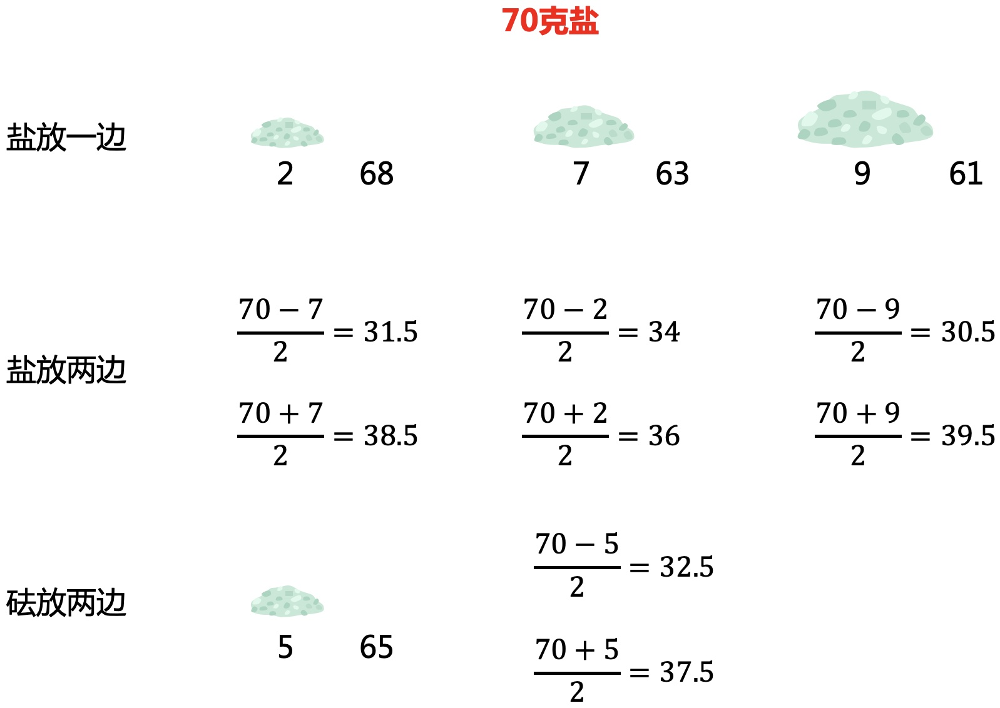

# 140克盐如何3次分成50克、90克？

### 1 故事起源
有一个天平，7克、2克砝码各一个，如何只用这些物品三次将140克盐分成50g，90g各一份？

### 2 不用砝码的情况
天平是用于衡量是否相等，所以如果不借助砝码，只能等分。

如第一次分成70和70，第二次可以分成35和35，第三次可以等分35或者105。

但上面分出的数值，是无法组合成50或者90的。所以接下来就考虑借助砝码的情况。 

### 3 借助砝码的情况
#### 3.1 方法一
砝码和盐各放一边，可以得到，$$2,7,9,x-2,x-7,x-9$$克重量。

#### 3.2 方法二
砝码放一边，将$$x$$克盐放两边，可以得到如下重量。

#### 3.3 方法三
砝码放两边，盐放一边或者两边。

这样就把所有的可能枚举完了，接下来就要看如果用这些方式组合成目标数。

### 4 用砝组合
#### 4.1 35克
前2步不用砝码可以得到35克，再结合砝码可以得到如下。

可以看到红色产生了15克，加上35克刚好50，这就有一个解。

#### 4.2 70克
前1步不用砝码，能得到70克，再结合砝码。  
称一次：

称二次：  
根据上面一次的结果来看，盐放两边和砝放两边都无法再组合。但如果盐放一边可以多一个砝。  
刚好发现如果先分成9+61。再用多的9+2来分61刚好得50，又得一个解。

#### 4.3 140克
一开始就借助砝码得到不同的重量，不过这个解很难直接看出来。

### 5 用砝码拼凑
如果按下面的方法称一次，就会得到相同重量的盐，所以也可以把右边的盐当成一个砝码，这样称三次就不只是2个砝码了。

接下来我们用这种方法，看能称出哪些重量的盐。

然后我们用这些数字，看能否组合成50或者90。   
很容易可以发现下面的红色加起来刚好就是50。

也就是要4个2g的，和6个7g的。

如果用数学方法也可以得到上面的结论。  
只有2个砝码，2克和7克的，如果用这2个来随意组合。  
设$$x$$个2克，$$y$$个7克，即$$2x+7y=50$$，整数解如下：  

|  x | y  |
|:----:|:----:|
| 18 |  2 |
| 11 |  4 |
| 4  |  6 |

因为只能称三次，前两组解是无法组合出这么多的，所以得到$$2\times4+7\times 6=50$$。  

#### 5.1 组合一
天平称一次，可以将重量翻一倍。上面砝码是分开的，次数不够，所以需要合并。  
重新组合成$$(2\times2+7\times 3)\times 2$$。  
那么最后一次要先得到$$2\times2+7\times 3=(2+7)+(2+7)+7$$，又得到一组解。   

具体过程如下：  
第一次，第二次：

第三次：

#### 5.2 组合二
这组解也很难直接发现，因为要利用到砝码的5g差。

### 6 过程抽象
整个过程其实就是一个搜索的思路，DFS或者BFS，但我想用动态规划里面的语言来抽象描述一下。  
初始条件：开局一个天平，2，7克砝码，140g盐。  
决策：第2，3小节里，不用砝码，和借助砝码的多种方法。  
阶段：总共称三次，每一次就是一个阶段。  
状态：每过一个阶段，能得到的不同的情况。  
状态转移：根据上面不同的决策转移到下一个状态。  

### 7 总结
初始条件很简单，但决策很多，每过一个阶段，状态也会成倍的增加。而且阶段有3层，最后的状态数已经很多了，人工模拟还是比较难的。最好的方法还是参考4、5小节，看能否快速找到一个可行解。

如果喜欢小K的文章，请点个关注，分享给更多的人，小K将持续更新，谢谢啦!

---
**扫描下方二维码关注公众号，第一时间获取更新信息！**  

 