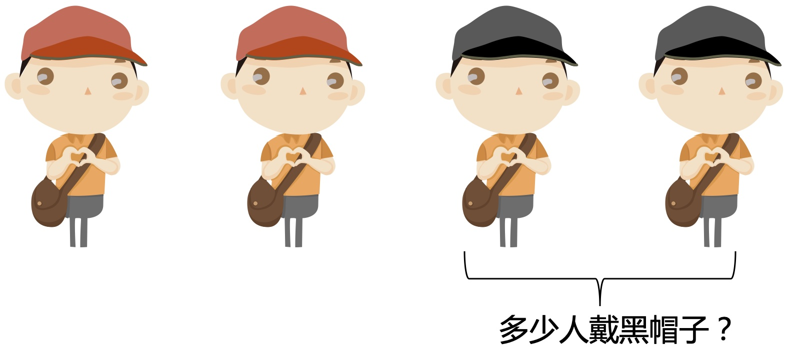

# 微软面试题：红帽子与黑帽子

### 1 故事起源
一群人开舞会，每人都戴着一顶帽子。帽子只有红和黑两种，其中黑的至少有一顶。每个人能看到其它人的帽子颜色，但看不到自己的。 

大家先一起做一个游戏，规则如下：  
所有人先看别人头上戴的是什么帽子，然后关灯，如果有人认为自己戴的黑帽子，就打自己一个耳光。  

游戏开始：  
第一次关灯，没有声音。

于是打开灯再看一遍，第二次关灯，依然鸦雀无声。  
一直到第三次关灯，才有声音响起。  

问：有多少人戴着黑帽子？

### 2 分析
假设有5个红帽子，和5个黑帽子。

对于红帽子的人，他看到的是有4个红帽子，和5个黑帽子。

对于黑帽子的人，他看到的是有5个红帽子，和4个黑帽子。

那么第一次关灯，对于任何一个人，只能得到上面的信息，他是无法判断自己的帽子颜色的，所以肯定啥也不发生。

### 3 寻找突破口
题目是问戴黑帽子的有几个人，跟具体人数相关。但我们再回到题目描述，并没有给总共多少人，也没有说红帽子有多少人，只有一个跟数字相关的条件，就是戴黑帽子的至少有一人，这就是突破口。  

所以这类的问题都可以从题目的信息量上面寻找突破口。  
没有说红帽子有多少人，说明解题的思路肯定跟红帽子没什么关系，有多少都无所谓，那就从黑帽子开始思考。

### 4 小规模简单场景
#### 4.1 假设只有1个黑帽子。  
对于每一个红帽子，他看到的场景是这样的。第一次关灯他们都无法确定自己帽子的颜色。

对于唯一的一个黑帽子，他看到的场景是这样的。因为至少有一个黑帽子，他没有看到，所以推出自己一定是黑帽子，第一次关灯声音响起。

#### 4.2 假设有2个黑帽子
对于每一个红帽子，他看到的场景是这样的。第一次关灯他们是无法判断的。

对于2个黑帽子，他看到的场景是这样的。

第一次关灯，他们都在等对方打耳光，所以什么也不会发生。

因为第一次没有声音，这时他俩都知道，第一次对方在等自己打耳光。所以这时他们都可以判断自己是黑帽子，第二次关灯声音响起。

#### 4.3 假设有3个黑帽子
对于红帽子的人来说，一定比黑帽子的人后得到信息，所以不考虑。

对于其中的每一个黑帽子，他们认为2次之后对方可以发现，结果两次之后因为都在等，不会有声音，那第三次都可以判断自己是黑帽子了。

#### 4.4 假设有N个黑帽子
根据上面分析，可以推论第N次声音响起。所以题目第3次有声音，也就意味着有3个黑帽子。

### 5 总结
对于所有的红帽子，他们的地位是相同的，也就是视角永远一样，对黑帽子也同样成立，所以如果有信息就会是同时得到，而不是一些人先发现。那这个问题就分红黑两类来考虑就行了。这也是属于博弈论相关的问题，可以先考虑小数据的简单场景。

如果喜欢小K的文章，请点个关注，分享给更多的人，小K将持续更新，谢谢啦!

---
**扫描下方二维码关注公众号，第一时间获取更新信息！**  

 