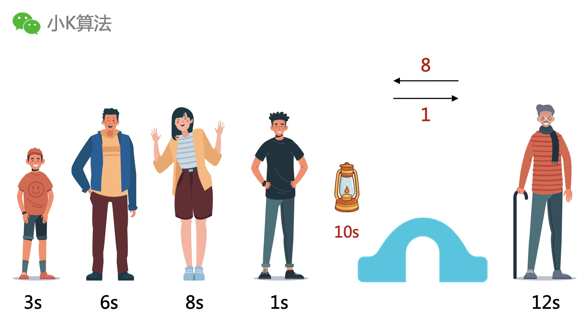

# 经典智力面试题：小明一家人过桥

作者 | 小K  
出品 | 小K算法 （ID：xiaok365）  

### 1 故事起源
小明一家人过桥，现在是黑夜，所以必须要有灯。小明过桥要1秒，弟弟要3秒，爸爸要6秒，妈妈要8秒，爷爷要12秒。  
此桥每次最多可过2人，过桥速度依最慢者而定，灯在点燃后30秒就会熄灭。  
请问小明一家应如何过桥？

### 2 思考
只有一盏灯，所以一个人过桥肯定不行，他还得把灯送回来。

那肯定得两个人一起过桥，同时还有一个人返回把灯送回来。

因为小明的耗时是最少的，那我们的第一想法就是由小明来拿灯并返回，分别和其它4人一起过桥。

### 3 小明拿灯
第一次，小明和弟弟一起过桥用3秒，返回1秒，还剩26秒。

第二次，小明和爸爸一起过桥用6秒，返回1秒，还剩19秒。

第三次，小明和妈妈一起过桥用8秒，返回1秒，还剩10秒。

第四次，因为爷爷要用12秒，时间不够，已经无法过桥了。那我们就要切换思路，还有没有更好的方法呢？

### 4 调整思维
先把每个人的耗时用图形展示出来，更直观。

可以把过桥想象成一个运输的过程，每次运输最大容量为2个矩形。  

假设小明和爷爷组合，或者妈妈和爷爷组合如下：

因为一定是以最慢的为准，也就是以最长的矩形为准，可以发现小明和爷爷组合浪费了很多空间，而妈妈和爷爷组合就浪费的比较少。这就启示尽量让运输效率更高，也就是浪费的空间越少越好。

### 5 抽象描述
有5个长度不一的木块，现在要用箱子装下所有的木块，每个箱子最多装2个，箱子的宽度等于所装的最大木块的宽度，怎样装可以让所有箱子的宽度总和最小？  
你品，你细品，如果不考虑返回送灯，是不是就很像上面的过桥问题。通过这种抽象描述，应该很多同学有一种熟悉的感觉。  
是的，你没有猜错，是不是很像动态规划里面的多个背包啊。

不过这个问题还用不到动态规划，用贪心的思想即可，尽量让相等的放一起，就可以浪费更少的空间。

### 6 回到之前的问题
根据上面的思想，让耗时相等的尽量一起。  
第一次，小明和弟弟一起过桥用3秒，小明返回1秒，还剩26秒。

第二次，妈妈和爷爷一起过桥用12秒，弟弟返回3秒，还剩11秒。

第三次，小明和爸爸一起过桥用6秒，小明返回1秒，还剩4秒。

第四次，小明和弟弟一起过桥用3秒，还有1秒。

小明一家人安全过桥，perfect。

### 7 总结
这类智力面试题，可以先尝试自己的第一感觉，如果不对就切换思路，思维不能局限，很快就可以发现规律了。

本文原创作者：小K，一个思维独特的s写手。  
文章首发平台：微信公众号【小K算法】。  

如果喜欢小K的文章，请点个关注，分享给更多的人，小K将持续更新，谢谢啦！

---
**扫描下方二维码关注公众号，第一时间获取更新信息！**  

 如果喜欢小K的文章，请点个关注，分享给更多的人，小K将持续更新，谢谢啦!