# 一道充满歧义的思维题，全网唯一刁钻分析

### 1 故事起源
有一人有240升水，他想运往干旱地区赚钱。有几个限制条件如下：  
* 每次最多携带60升
* 每前进1公里须耗水1升(均匀耗水)
* 水的价格与路程成正比，出发地为0元/升，前进10公里处为10元/升
* 他必须安全返回出发地

那么应该采取怎样的策略，赚取最多的钱？

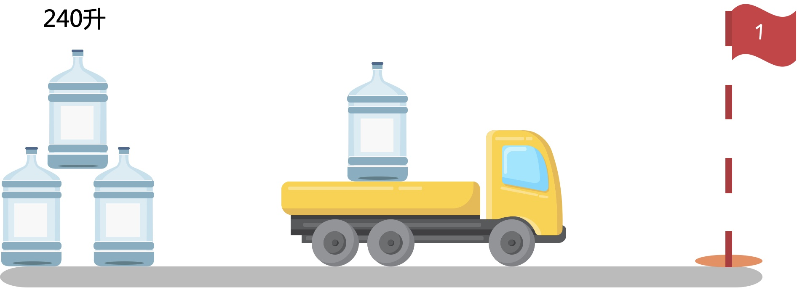

### 2 分析
总共240L，每次最多60L，那就分4次运输。假设前进$$X$$公里处卖掉：  
则收益为：$$y=(60-2x)\times x \times 4$$

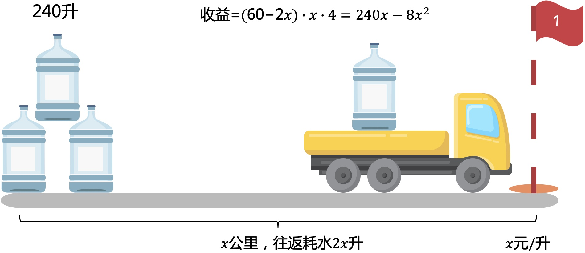

这样就变成了一个二次函数求最值问题，画出函数图像如下：

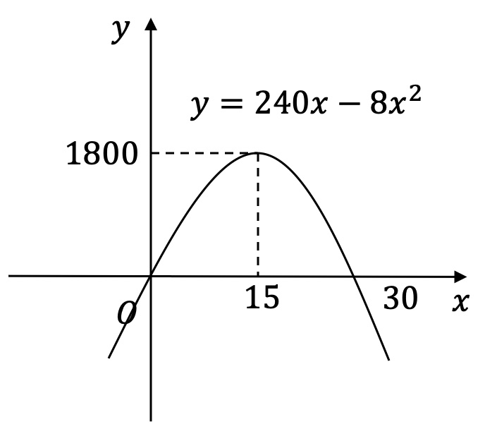

得到结论：分4次往返运输，每次装满60L，前进15公里的地方卖掉，再返回。  
总共获利：$$y=240 \times 15-8\times 15^2=1800$$。  

那这样问题貌似已经完美解决了，网上其它的分析基本也都是这样，但题目貌似有一些歧义，接着我们继续往下分析。

### 3 深入思考
题意描述是一个数学模型，但其实我们也可以反向建模。以前都是将生活场景抽象成数学模型，这次我们尝试找一个对应的生活场景。  
上面我们通过计算得到了结论，但应该怎么去理解呢，它是否具备可解释性？

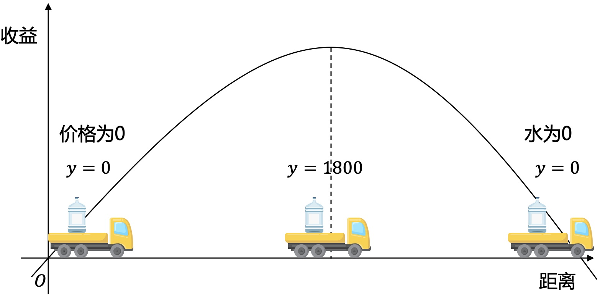

这样来理解：水在原产地没有价格差异，所以不论有多少，收益都为0。运输到了外地产生了价格差，但运输成本也会增加。 

那收益为什么会存在一个确定的最大值呢？  
比如在成都产的小麦，为啥不运输到纽约去卖呢。先不考虑其它的客观条件，只通过计算经济收益来考虑。

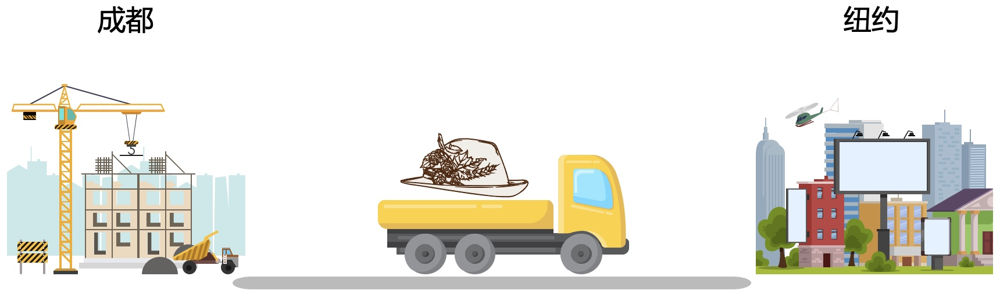

先来研究一下价格、运输成本与距离的关系。

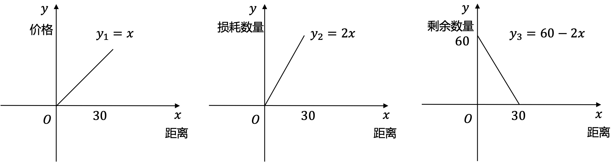

通过上面的函数图像可以发现：  
* $$收益=价格\times 剩余数量，即收益=x(60-2x)$$，这不是线性关系，因为货物数量在越来越少
* $$只看成本，则成本=损耗数量\times 价格，即成本=2x^2$$，也不是线性增长，因为成本是损耗的货物本身，而货物本身的价格在增长，所以成本以非线性上升

如果理想场景，价格与距离成正比，运输成本也与距离成正比，且货物数量不变。  
则收益为：利差*数量

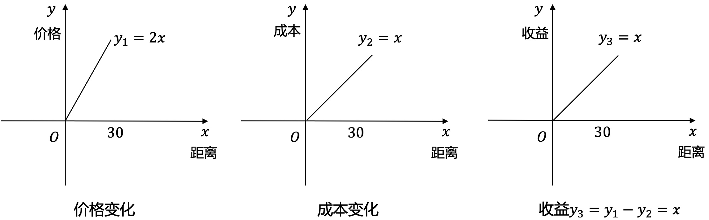

那么收益与距离成正比，距离越远，收益就越高。如果从成都运输小麦到纽约符合这个模型，那么肯定应该把小麦卖得越远越好，但实际生活中，有很多其它的因素，不满足线性关系。  
比如到纽约的小麦价格涨10倍，但成本却要涨100倍，这样收益就会越来越低，甚至亏损。  

### 4 对生活场景的思考
场景1：  
平时外出经常需要打车。打车人数一般不会变，单价固定，而司机的成本也就考虑油费，这时司机的收益可以假设与里程成正比，那么跑得越远，收益越多。  
所以你打车的时候会发现，他们都喜欢跑距离远的单子，近距离一般都不喜欢接。

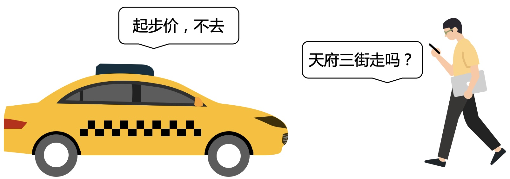

场景2：  
收益=利差*数量，通过这个公式，可以看出要提高收益，就增大利差或者增大销售数量。所以为啥iphone要卖向全球，因为能提高销售数量，至于利差也不一定要比原产地高，但整体收益肯定会增加。从市场经济的角度来说，理论上有更高利润，那么这个经济行为就可以发生。

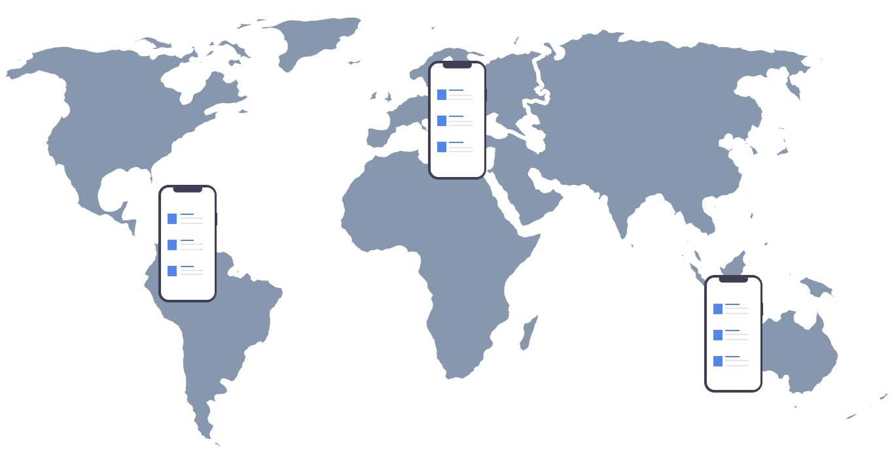

场景3：  
回到之前的问题，随着距离的增加，货物越来越少，最后可能是一个大货车运一瓶矿泉水，也可以理解为运输效率越来越低，成本自然就越来越高。

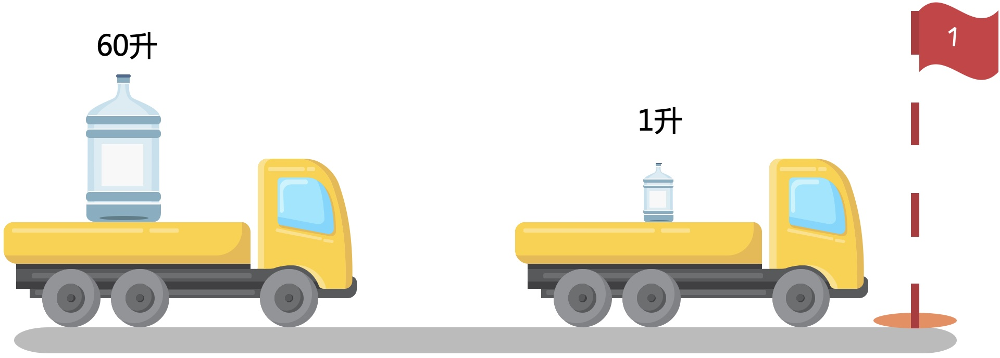

比如网购的快递运输。快递在长途运输是用大货车，但最后派送却是用的电瓶车，你应该没见过一个大货车装几个包裹开你家门口吧，快递公司都是有很多的中转站。

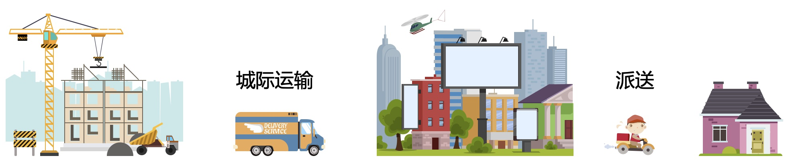

那么之前的问题，是否也可以用中转的方式呢，这就是有歧义的地方。题目没有说必须一次运输到目标点再全部卖掉，接着我们继续分析。

### 5 中转
为了解决运输效率低，我们肯定是希望货车尽量的满载，因为限制最多60L，那就尽量装满60L，所以可以在中途建立中转站。  
中转站建设规则：
* 240L，要运输4次，如果有181L，也要运输4次，所以保证每个中转站都还剩60的倍数
* 在到每一个中转站途中，选择最大的收益卖掉，最后比较取全局最优
* 到达一个中转站，如果不卖，就要将返程的水放这里，等返回的时候再装上

#### 5.1 第一站，7.5公里
运输4次，最佳卖点是7.5公里的位置，最多可得1350元。如果不卖就往返7次，留7.5L在此处，继续往前转运，返程再装回7.5L。

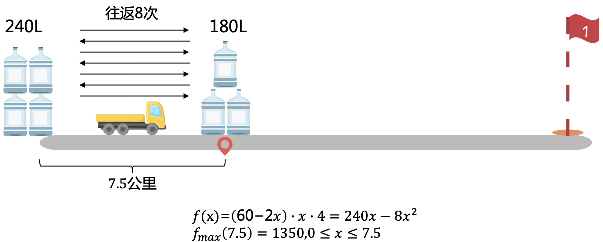

#### 5.2 第二站，10公里
在站点卖掉，最多可得2100元。

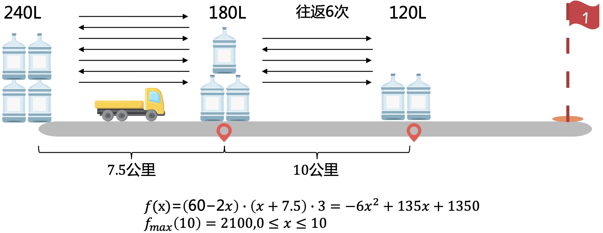

#### 5.3 第三站，15公里
在距离第二站6.25公里处卖掉，最多可得2256.25元。

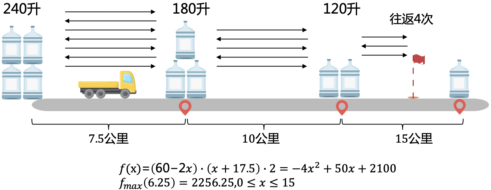

如果在第3站站点卖掉得60*32.5=1950，往后只会更低。所以按上面方式转运，最多可得2256.25元。  

ok，我们成功的把一个简单的问题复杂化了，perfect。

### 6 总结
简单的问题也要多深入思考，全方位360度无死角，就有可能发现很多不一样的结论。生活中的各种场景都可以和严谨的数学联系起来，关键是能否找出他们的本质规律。

如果喜欢小K的文章，请点个关注，分享给更多的人，小K将持续更新，谢谢啦!  

---
**扫描下方二维码关注公众号，第一时间获取更新信息！**  

  