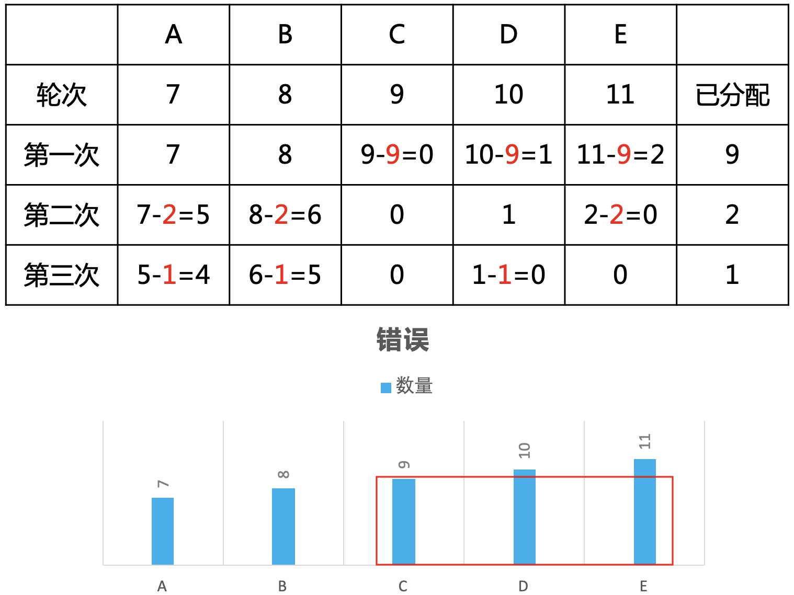

# 一道错误答案传遍全网的逻辑面试题

### 1 故事起源
100个人回答五道题，有81人答对第一题，91人答对第二题，85人答对第三题，79人答对第四题，74人答对第五题。  
答对三道题或三道题以上的人算及格，那么在这100人中至少有多少人及格呢？
<div align=center></div>

### 2 思考小规模，AB两题
先考虑如果只有AB两道题，100个人，第一反应是用集合的方式。
<div align=center></div>

总共也就上面3种情况，其中第一种人数大于100非法，所以只存在后面2种情况。  
可以得到如下结论：  
* 同时做对AB两题的最少有72人，最多有81人
* 同时做错AB两题的最多有9人，最少有0人

看来已经找到了规律，那就按这个思路进一步扩大数据规模，考虑ABC三题。

### 3 扩大规模，ABC三题
先考虑每两题之间的关系。
<div align=center></div>

再合成三题的关系。等等，好像有点复杂，这不是线性的复杂度，不好意思，小K的智商有点不够用，自闭了。
<div align=center></div>

那小K是不是要准备放弃了呢，NO，never say give up。有时候不要撞倒南墙不回头，基于小K多年的经验，如果找到的规律不明显或者很复杂，一般都说明你走错了，所以这时要考虑切换思维方式。

### 4 切换思维
上面都是正向思维，但不好处理，可以逆向思维。
<div align=center></div>

只要错3道就不及格，一共有19+9+15+21+26=90道错题，那么90/3=30，则最多有30人不及格，所以最少有70人及格，perfect，收工。

Wait，总感觉有点怪怪的，倒不是因为太简单，而是对于信息量的直觉告诉我，这种解法忽略了很多的信息量。  
只用了总数，而没有用到5道题的错题数量分布。那就直接告诉你总共错了90道就行了，为啥还要单独告诉具体的数量，这难道真的只是误导信息吗？

### 5 极限法思维
根据上面的解法，既然不关心具体分布，那就用极限思维，构造特殊数据。比如所有错题集中在A题。
<div align=center></div>

总共还是错90道，但所有人都做对4题，应该是100人及格，再一次自闭。  

这时，我想应该有杠精要跳出来了。
<div align=center></div>

小K：你说的很有道理，我竟无言以对。  
先不跟你扯，咱们进一步思考，这个反例说明了一点：错题不能随意均摊，那就从这点下手。

### 6 错题均摊
先看错误的分布。
<div align=center></div>

如何将这些错题分配给最多的人。为了分析方便，先写一个简单的例子，如错题分布为7、8、9、10、11。  
第一种分配：
* 将A,B,C分配给7人
* 将C,D,E分配给2人
* 将B,D,E分配给1人

总共可分配7+2+1=10人。
<div align=center></div>

第二种，优先分配B,C,D，总共11人。
<div align=center></div>

第三种，优先分配C,D,E，总共12人。
<div align=center></div>

到这里我们已经发现了规律，优先分配最大的3道会得到更多的人数。而在分配过程中最大的3道顺序会动态变化，这就启发了贪心的思想。  
* 将错题从大到小排序
* 每次将最大的前3个分配给一人，然后重新排序

重复上面步骤，直到最后找不出3个不为0的数，也就是变为X,0,0,0,0或者X,Y,0,0,0。

### 7 抽象
转换问题：有5个矩形，顺序可随意。要切出宽度为3的N个矩形，要求总体叠加要尽量的高，最高有多少?  
你品，你细品，这是不是同一个问题呀。所以要从最高的前3个开始一点一点的削它，哈哈。
<div align=center></div>

### 8 真相浮出水面
回到原题，那到底至少有多少人呢？通过代码测试结果。  
**代码实现**
```cpp
int main() {
    int a[5], ans = 0;
    for (int i = 0; i < 5; ++i) {
        cin >> a[i];
    }
    sort(a, a + 5, compare);
    while (a[2] > 0) {
        a[0]--;
        a[1]--;
        a[2]--;
        sort(a, a + 5, compare);
        ans++;
        for (int i = 0; i < 5; ++i) {
            cout << a[i] << " ";
        }
        cout << endl;
    }
    cout << "ans=" << ans << endl;

    return 0;
}
```

**数据测试**
```cpp
25 20 18 15 9 
24 19 17 15 9 
23 18 16 15 9 
22 17 15 15 9 
21 16 15 14 9 
20 15 14 14 9 
19 14 14 13 9 
18 13 13 13 9 
17 13 12 12 9 
16 12 12 11 9 
15 11 11 11 9 
14 11 10 10 9 
13 10 10 9 9 
12 9 9 9 9 
11 9 9 8 8 
10 8 8 8 8 
9 8 8 7 7 
8 7 7 7 7 
7 7 7 6 6 
6 6 6 6 6 
6 6 5 5 5 
5 5 5 5 4 
5 4 4 4 4 
4 4 4 3 3 
3 3 3 3 3 
3 3 2 2 2 
2 2 2 2 1 
2 1 1 1 1 
1 1 1 0 0 
0 0 0 0 0 
ans=30
```

所以至多30人不及格，则至少70人及格，答案虽然一样，但思维方式却不一样。

### 9 总结
看似简单的问题，也要多深入思考，说不定你会发现不一样的结论。而且也别轻易相信别人的分析，这个问题网上90%都是错的，大家也可以看一下我的分析是否严谨，如果有问题也请及时反馈给我哈，谢谢啦。

如果喜欢小K的文章，请点个关注，分享给更多的人，小K将持续更新，谢谢啦!

---
**扫描下方二维码关注公众号，第一时间获取更新信息！**  
<div align=center></div> 