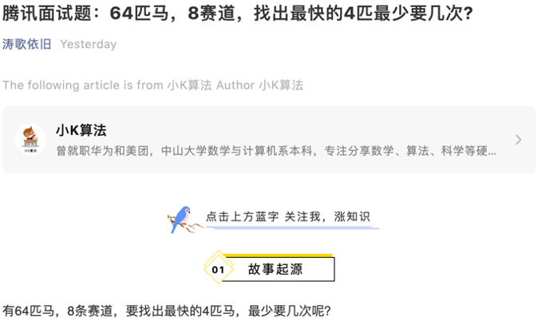

# 听说小K的马儿火了？

### 引言

写这篇文章主要有3个原因：  
1、小K之前一篇名为《腾讯面试题：64匹马，8赛道，找出最快的4匹最少要几次?》的文章火了，目前转载几十次，还在持续发酵。  
2、有人问小K，”你的文章是不是被白嫖了？”  
答：小K之前为了开留言，进行了账号迁移，所以之前的账号被注销，导致文章转载信息丢失，所以你们看到的我的文章都是我这边主动找号主投稿，或者是之前就开了长期白名单，丢失信息的几个号主我会在下面列出来，所以不要投诉这些号主哈，小K也真心感谢大家的反馈。  
3、因这篇文章引发了读者大量的疑问，但小K没法在其它号下面一一回答，所以就针对几个最多的疑问进一步解释。  

### 1 听说我火了？
没想到小K的马儿真的是一匹黑马呀。

### 2 第一波转载
下面的几个号都是小K在账号迁移之前转载的，所以丢失了小K的转载信息。  

感谢“算法爱好者”转载。

感谢“吴师兄”转载。

感谢“IT服务圈儿”转载。

感谢“TechFlow”转载。

感谢“ACM算法日常”转载。

### 3 持续发酵
下面以时间顺序列举几个，因为转载次数太多没法全部列举，其它的号主小K都记着，以后成长起来一定帮你们带量，真心感谢。  
感谢“涛哥”转载。

感谢“Linux爱好者”转载。

感谢“yes的练级攻略”转载。

感谢“五角钱的程序员”转载。

### 4 引发大量疑问
现在全网阅读量好几W了，我看到提出的疑问估计也快上百条了。

在其它号主平台不方便回复，所以在这里对这些问题进行统一总结和答复。  

### 5 答复
先看原文我的问题是这样描述的：  
“有64匹马，8条赛道，要找出最快的4匹马，最少要几次呢？”

主要的问题集中在以下几方面：  
1、直接用计时器，每次8匹分8次跑完，按时间顺序排序不就行了吗？
只能说不知道有同学会这样想，那确定应该在题目上加这个限制，不能用计时器。面试题应该也不会考察你会不会用计时器呀，对不？  

那小K再补充一下，只能利用相对名次通过逻辑推理来找出前4名。  

题目没有说明的限制这确实是一个漏洞，但这样想那漏洞就多了去了呀，哈哈。

2、马每次跑的速度是一样的吗？  
这个也确实应该加上，默认每匹马的速度不变，不考虑马儿的生理因素哈。

3、如果有并列名次的马儿怎么办？
这个也确实应该加上，如果8匹马速度都一样，那跑一次就什么信息也得不到，不得不说大家考虑的还真是周到呀。

4、题目说的最少多少次，为什么最后又说最多11次？
可能小K描述不够准确，那小K再重新描述一下：在某种小概率的巧合下，原文也说明了，就是A3排在第3或者更后，那么最少就是10次。不考虑特殊场景最少就是11次，可以稳定求出解。

如果还有其它问题的，请在下方留言哈，小K将一一回复大家。

如果喜欢小K的文章，请点个关注，分享给更多的人，小K将持续更新，谢谢啦!

---
**扫描下方二维码关注公众号，第一时间获取更新信息！**  

 