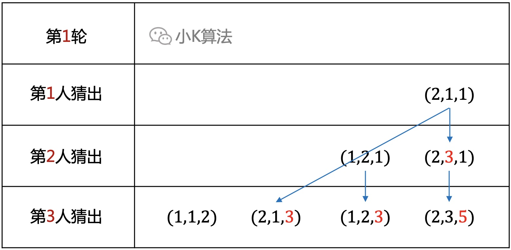

# 逻辑面试题：1+1=2最复杂的打开方式

作者 | 小K  
出品 | 公众号：小K算法 （ID：xiaok365）  

### 1 故事起源
一个逻辑学教授，有三个学生，而且三个学生都非常聪明！  
有一天教授给他们出了一个题：  
* 教授在每个人脑门上贴了一张纸条
* 每个人的纸条上都写了一个正整数，且某两个数的和等于第三个数
* 每个人可以看见另两个数，但看不见自己的

教授问第一个学生：你能猜出自己的数吗？回答：不能。  
问第二个，不能；第三个，不能。  
教授再问第二次：  
第一个，不能；第二个，不能；第三个，我猜出来了，是144！  
教授很满意的笑了，请问你能猜出另外两个人的数吗？
<div align=center></div>

### 2 场景重现
要破解这个问题，就要先扮演这个角色，我们来场景模拟一下，3个同学围绕站成一个圈。
<div align=center></div>

为方便描述，用下面的图形来表示。
<div align=center></div>

因为只能看到别人的数，看不到自己的，所以小K的视角是这样的。
<div align=center></div>

同样小A的视角是这样的。
<div align=center></div>

小B的视角是这样的。
<div align=center></div>

发现了什么规律吗，我们总结一下：  
* 每个人自己的数只能是另两数之和或者之差，所以每个人都有2种可能。
* 每个人都无法确认自己到底是哪一个，也不能从其他人那里得到更多信息。

因此，看上去貌似是个死局。  
再仔细思考，既然只有2种可能，那能不能排除一种可能，这样只剩下另一种肯定就是正确答案了。关键是如何去寻找这个突破口呢？

### 3 寻找突破口
要排除不可能的解，必须要从边界入手，如果没有任何条件限制，那这就是一个无解的问题。  
再回到问题描述，**“每个人的纸条上都写了一个正整数”**，这就是最关键的信息，它暗示了很多其它信息。如果有一个人计算出来的数不是正整数，那这一种情况就被排除。  
这个数不可能是负数，因为2个不相等的数，一定是用大的减去小的，那剩下的非正整数就只能是0，也就是有2个数相等的情况。

假设小K看到的是这样的场景，那一定能猜到自己的数就是10。
<div align=center></div>

现在有了一点进展，但还是不够，因为2个数相等也只是一种巧合，大部分的时候，你看到的数都不相等，感觉还是很难走下去。
<div align=center></div>

先别想得太复杂，咱们来降维打击。
<div align=center></div>

### 4 从小规模分析
关注小K很久的同学应该已经发现了，小K最喜欢用的手段，就是从小规模开始分析问题，再逐层推进。  
如果2个数相等，抽象一下，不就是一个最简单的1+1=2的问题吗？
<div align=center></div>

如果是下面这种情况，会在第1轮由第1人直接猜出。
<div align=center></div>

同样对于另外2个人也是一样，能在自己的轮次直接猜出。
<div align=center></div>

我们似乎已经解决了3种场景了，应该是走对了，继续往下推，再扩大数据规模。不过相等的我们已经列举完了，都可以归类为1+1=2的问题，那怎么推广到不等呢？

### 5 第1人猜不出
第1轮询问，如果第1人猜不出，对于后面的人来说给出了另一个信息，就是这3个数肯定不是(2,1,1)，因为如果是(2,1,1)那第1人肯定就猜出来了啊。
<div align=center></div>

那怎么利用这个信息呢？  
如果小A看到的场景刚好是这样，(2,y,1)，那y不是1，肯定就是3了呀。
<div align=center></div>

总结一下前面的情况。
<div align=center></div>

### 6 第2人猜不出
如果第2人猜不出，对于第3人来说，也给出了很多信息，说明一定不是(2,1,1)，(1,2,1)，(2,3,1)。
<div align=center></div>

如果第3人刚好看到的是(2,1,z),(1,2,z),(2,3,z)，那就可以直接猜出。
<div align=center></div>

总结第1轮分别能被3人猜出的情况如下：
<div align=center></div>

而且我们发现，每一个人能猜出的情况，是由前2个人能猜出的情况迭代过来的。因为前面的人猜不出就排除了一种可能，只剩下另一种，自然能被后面的人猜出。

### 7 第2轮
如果第1轮第3人也没猜出，就会进入下一轮。  
第2轮第1人能猜出的情况如下：
<div align=center></div>

同理第2轮第2人能猜出的情况如下：
<div align=center></div>

第2轮第3人能猜出的情况如下：
<div align=center></div>

回到开始的问题，第3个同学在第2轮猜出自己是144，所以上面的16个解中，第3个数字能被144整除的，都是符合条件的解。  
正确的解有5个：(3,1,4)，(1,3,4)，(2,7,9)，(4,5,9)，(3,5,8)。  
对应的另外两个数分别是：(108,36)，(36,108)，(32,112)，(64,80)，(54,90)。

### 8 任意情况
比如为(98,27,71)的情况，根据上面的规律，最终还是会回归到1+1=2的问题。
<div align=center></div>

结论：  
* 3个数要先约掉公约数，等比例的情况都是相同的
* 任意情况，都会在有限轮次之后被某个人猜出来
* 最先猜出来的人，一定是数字最大的人
* 所有逻辑推理的根基都是1+1=2
* 每多一轮，解的个数以斐波那契数列递增

### 9 代码实现
**定义及初始化**
```cpp
struct Node {
    int x, y, z, level;
};
Node f[10000];
int last1, last2, tail;
void init() {
    f[0] = Node{2, 1, 1, 1};
    f[1] = Node{1, 2, 1, 2};
    f[2] = Node{2, 3, 1, 2};
    f[3] = Node{1, 1, 2, 3};
    f[4] = Node{2, 1, 3, 3};
    f[5] = Node{1, 2, 3, 3};
    f[6] = Node{2, 3, 5, 3};
    last1 = 3;
    last2 = 1;
    tail = 7;
}
```
**关键算法**
```cpp
// 第round轮，第person人，猜出自己是x
void solve(int round, int person, int x) {
    int n = (round - 2) * 3 + person, total;
    for (int i = 0; i < n; ++i) {
        total = tail;
        for (int j = last2; j < total; ++j) {
            if (i % 3 == 0) {
                f[tail++] = Node{f[j].y + f[j].z, f[j].y, f[j].z, 4 + i};
            } else if (i % 3 == 1) {
                f[tail++] = Node{f[j].x, f[j].x + f[j].z, f[j].z, 4 + i};
            } else {
                f[tail++] = Node{f[j].x, f[j].y, f[j].x + f[j].y, 4 + i};
            }
        }
        last2 = last1;
        last1 = total;
    }
    for (int i = last1; i < tail; ++i) {
        int temp = 0;
        switch (person) {
            case 1:
                temp = f[i].x;
                break;
            case 2:
                temp = f[i].y;
                break;
            case 3:
                temp = f[i].z;
                break;
        }
        if (x % temp == 0) {
            int s = x / f[i].z;
            printf("(%d, %d, %d), level=%d\n", f[i].x * s, f[i].y * s, f[i].z * s, f[i].level);
        }
    }
}
```
**主过程**
```cpp
int main() {
    init();
    solve(2, 3, 144);
    return 0;
}
```
**数据测试输出**
```cpp
(108, 36, 144), level=6
(36, 108, 144), level=6
(32, 112, 144), level=6
(64, 80, 144), level=6
(54, 90, 144), level=6
```

### 10 总结
第一眼看上去觉得简单，初步思考发现没有思路，感觉有难度，认真一步一步的分析下去，又会发现其实还是很简单，关键在于能否发现本质规律。这是一道极强的逻辑推理，大家一定要认真分析领悟，相信你可以学到很多的知识，打开思维模式。

本文原创作者：小K，一个思维独特的写手。  
文章首发平台：微信公众号【小K算法】。  

如果喜欢小K的文章，请点个关注，分享给更多的人，小K将持续更新，谢谢啦！

---
**扫描下方二维码关注公众号，第一时间获取更新信息！**  
<div align=center></div> 如果喜欢小K的文章，请点个关注，分享给更多的人，小K将持续更新，谢谢啦!