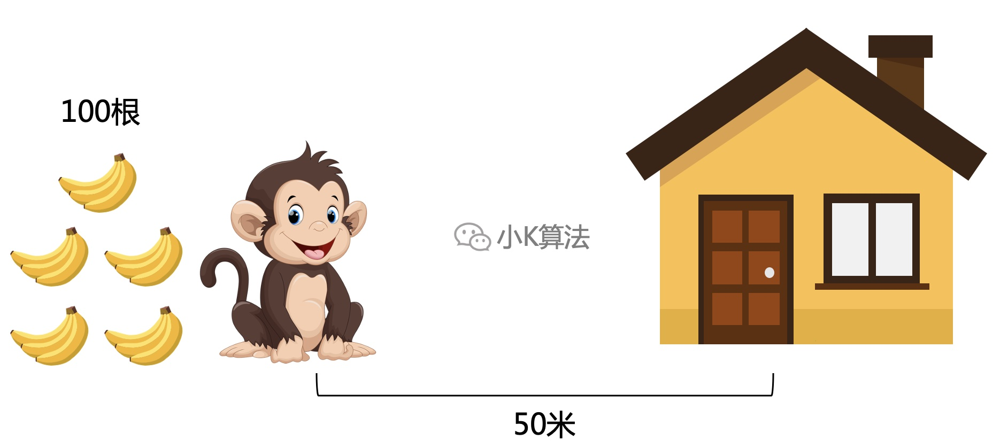
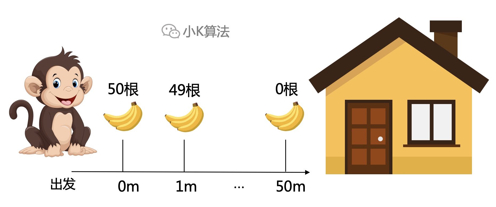
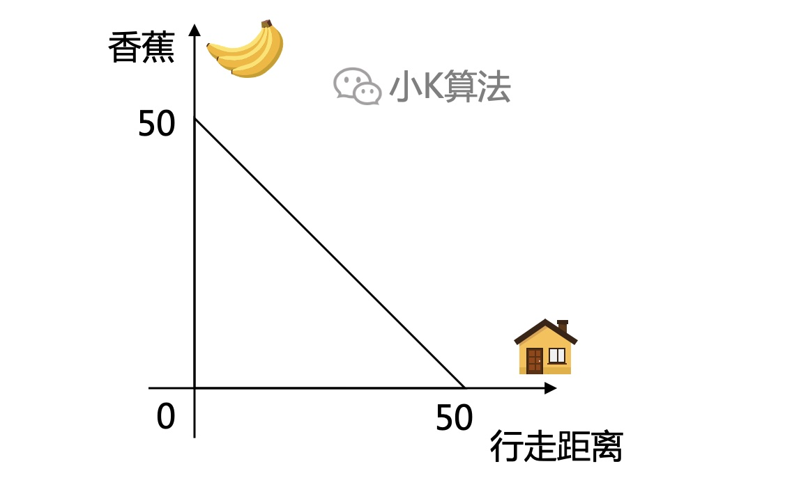
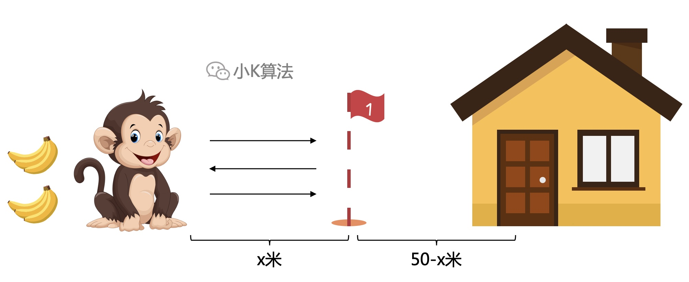
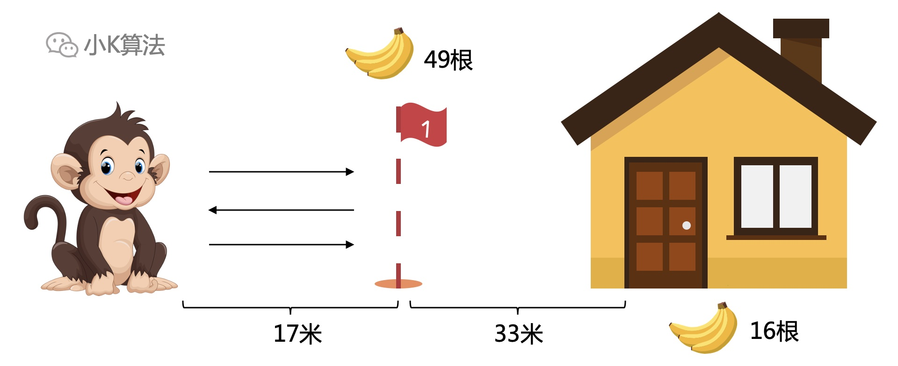
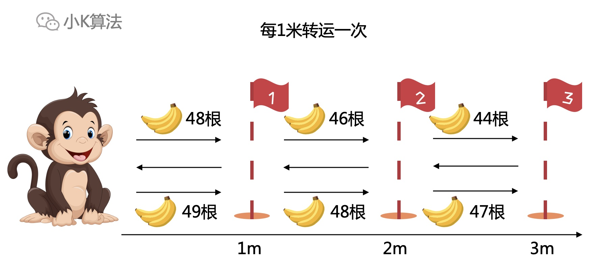
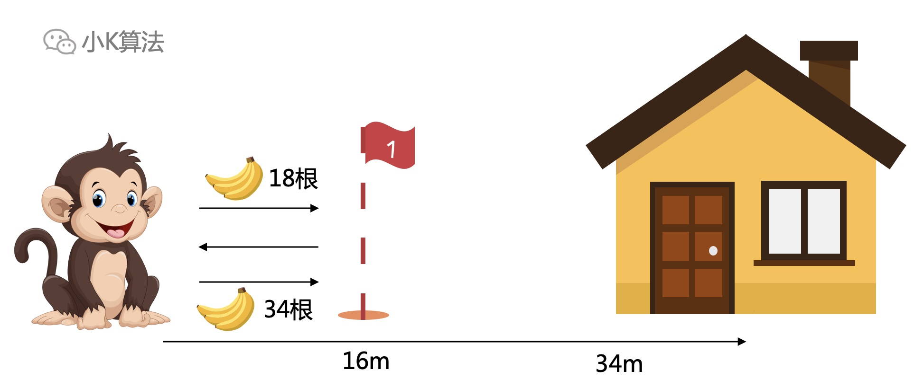

# 逻辑面试题：猴子搬香蕉

### 1 故事起源
一只小猴子边上有100根香蕉，此地距离它家50米，小猴想搬香蕉回家，但有以下几个条件：  
* 每次它最多搬50根
* 它每走1米就要吃掉1根

请问小猴最多能把多少根香蕉搬回家呢？

### 2 初步思考
小猴同学最多只能搬50，那就搬50根往家走。

很快我们就能发现问题，所剩香蕉与行走距离有如下线性关系，当走到家时，香蕉为0。

还记得小K之前写过一篇文章，240L水的问题，[240L水](../4/运水.html)。  
这两个问题有很大的共同点。把小猴同学想象成一辆车，香蕉想象成油，每前进1米消耗1根。整个过程就是一个运输过程。
之所以出现上面的问题，就在于运输效率会线性下降，快到家时，车上只有几根香蕉，但油耗依然不变。

所以还是要采用之前的思路，通过中转来提高运输效率，尽量满载。

### 3 中转
总共100根，所以转运最多2趟。而且小猴同学不用返回出发地，所以中转地与出发地之间往返3次。

中转是为了下一次能够一次运输完，所以到达中转地之后，香蕉数要小于等于50。  
设到中转站x米，则100-3x<=50，x=17米。

所以第一次搬50到17米处，留下16根，再拿17根返回出发地。第二次搬50到中转站剩下33根，总共49根。然后拿上49根回家，还剩下16根。

### 4 每一米转运
这里借用一下微分的思想，将中转无限分段，假设每隔1米转运1次，那么每一段之间都是往返3次。如果再把这些区间积起来，其实就和上面的思想一样了。

走到16米的地方还有一个特别的点。现在还有52根香蕉，距离家还有34米。此时只拿50根回家，也能搬回16根香蕉。

### 5 总结
这类问题最直观的第一感觉，就是越到后面阶段，运输效率越低，所以能想到中转。跟现实生活中的快递运输是一样的，快递也会有很多的中转站。之前240L水的问题，有读者同学反馈，到达第3站的地方，还可以在6.25公里的地方卖掉35L，剩60L再继续运输3.125公里，此时卖掉还可以得到更高的收益2275.78125，也感谢这位同学的反馈。中转站的设立是可以无限微分划区间，再用积分来计算，但这样就太复杂了，所以用分段的思想能解决大部分的问题。

本文原创作者：小K，一个思维独特的写手。  
文章首发平台：微信公众号【小K算法】。  

如果喜欢小K的文章，请点个关注，分享给更多的人，小K将持续更新，谢谢啦！

---
**扫描下方二维码关注公众号，第一时间获取更新信息！**  

 