# A先生的太太到底和谁握了手？

### 1 故事起源
有5对夫妇举行家庭聚会。每一个人都可能和其他人握手，但夫妇之间绝对不握手。  

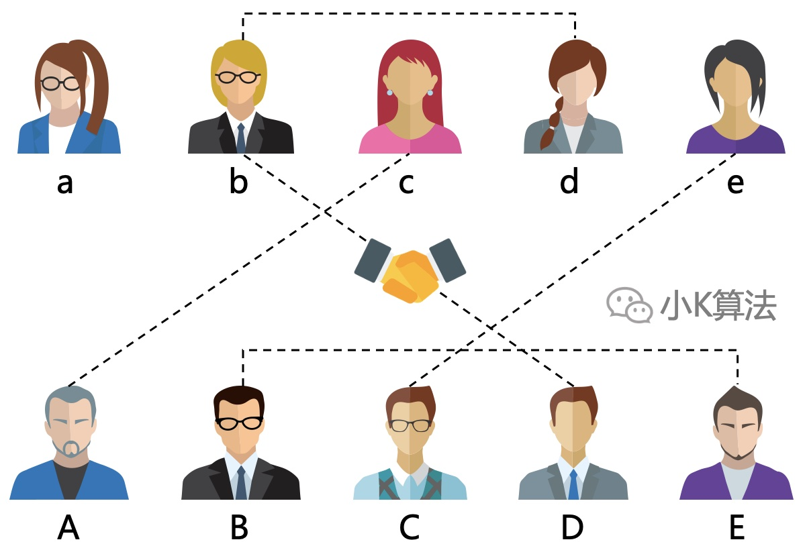

聚会结束时，A先生问大家握手几次，结果是每个人的握手次数都不相同，那么请问**A先生的太太**握手几次？

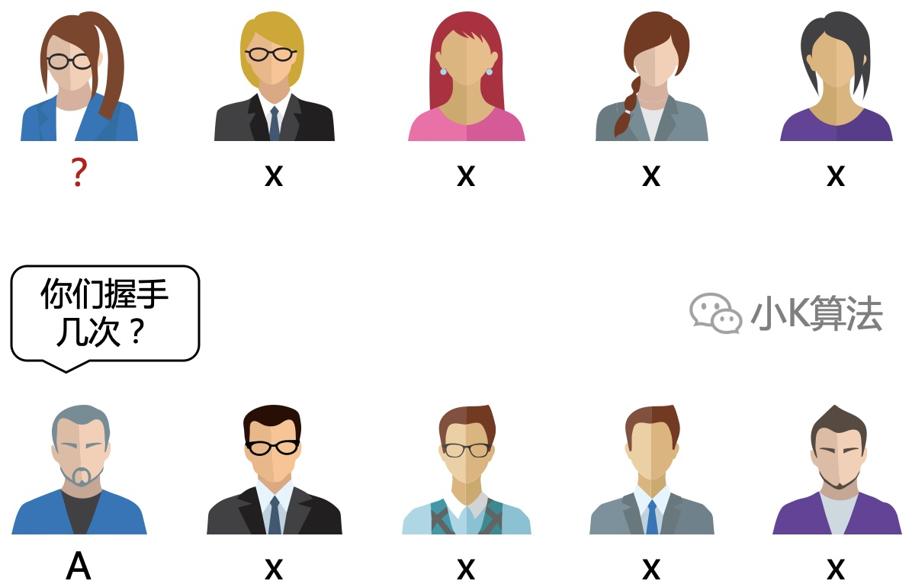

### 2 提取信息
首先我们对已知信息进行高度总结，提取出来。这是为了屏蔽其它的干扰信息，避免影响分析。

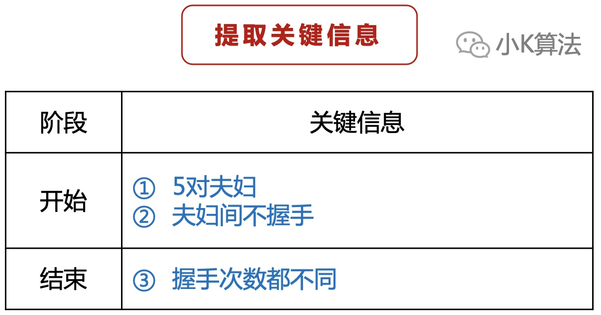

如果把问题中的数字做一个小调整，这样感觉会简单一些，但其实问题的本质并没改变。所以有时可以适当缩小问题规模以方便进一步分析，从而可以快速找出问题本质。

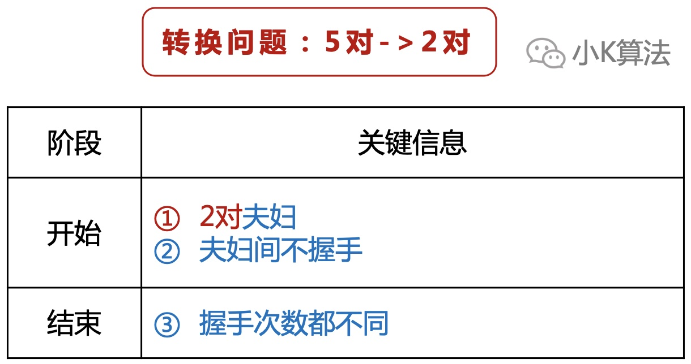

### 3 小规模分析
假设现在只有两对夫妇，他们能握手的情况如下。

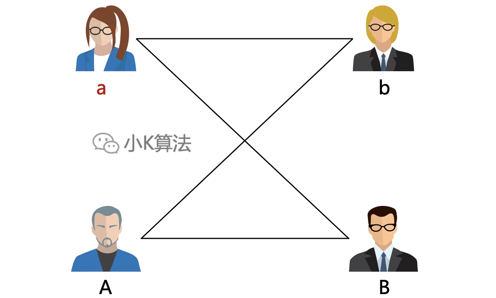

当然肯定不能左手握右手，也不能夫妇间握手，每个人最多握手2次，最少握手0次。

如果现在除了A先生，其他3人握手次数都不同，那你能得到什么信息呢？

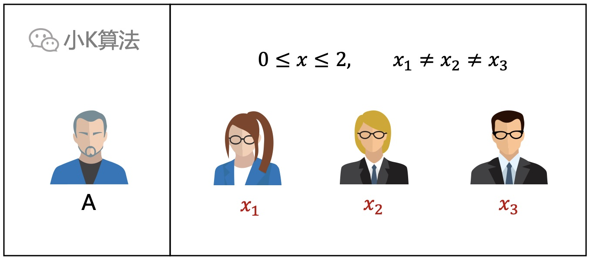

因为次数在0~2，那其它3个人的握手次数不就分别是0，1，2吗，比如下面这样。

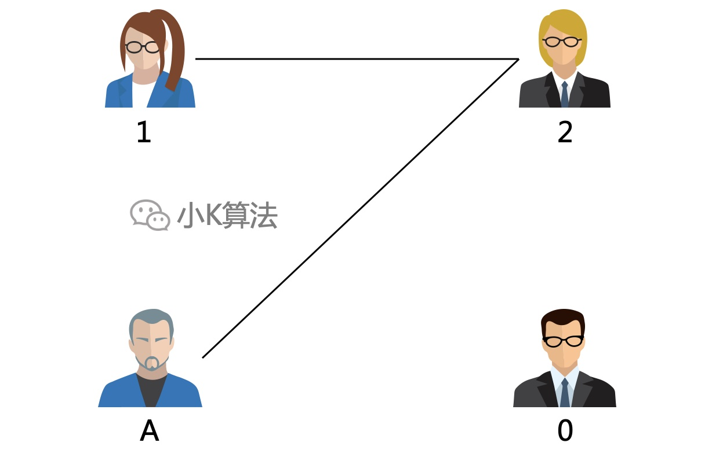

那还能得到什么重要的信息吗？我们继续往下分析。  
0次表示没有和任何人握手。根据上面的分析知道最多只能握手2次，那2次的也就是和所有能握手的人都握手了，那这和0次的矛盾吗？

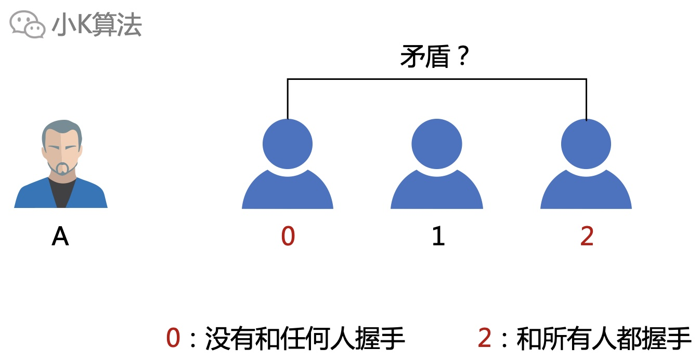

其实不矛盾，每个人除了不能和自己握手，也不能和配偶握手啊。说明0次和2次的其实是夫妇，那1次的不就是A先生的太太了吗？

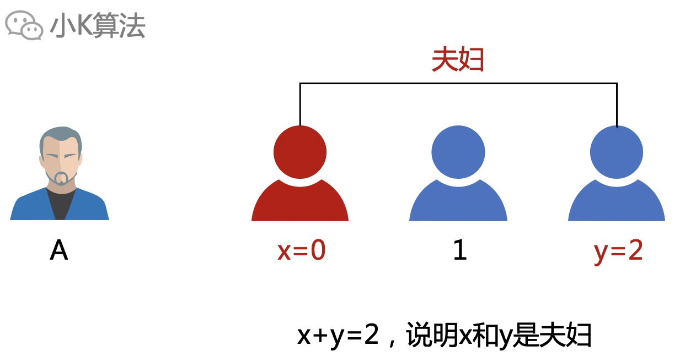

根据简单情况的分析，我们已经找出了规律，那剩下的自然就是带回原问题的数据，再套用走一遍就行了。

### 4 回到原问题
5对夫妇，总共10个人，除了自己和配偶不能握手，每个人的握手次数最少0次，最多8次。因为次数都不同，所以除了A先生，其他9个人的次数就分别是0~8。

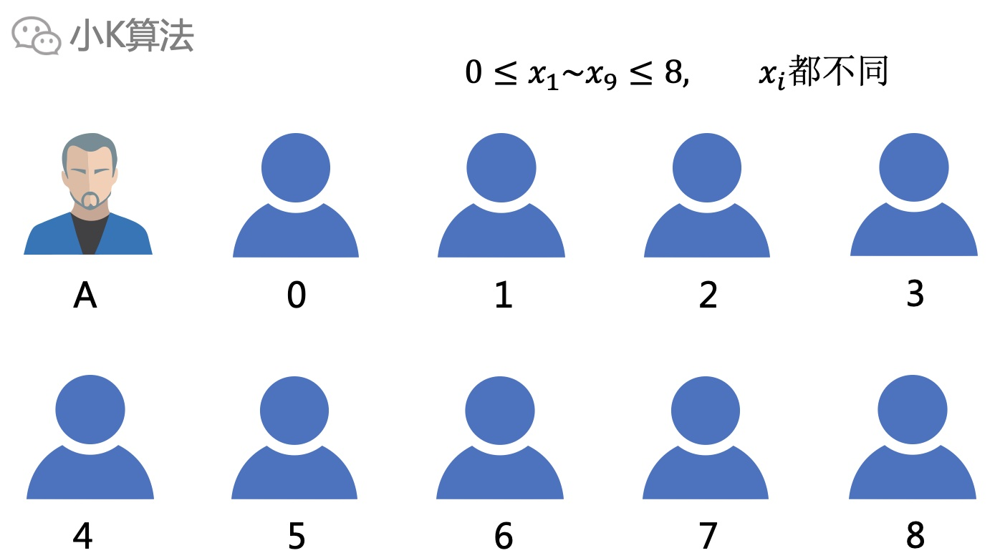

8次的和所有人握手，但没有和0次的握手，所以0次和8次的是夫妇。

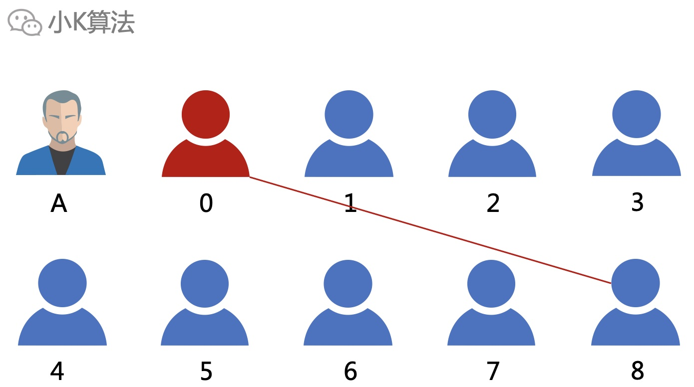

那1次的这个人他是和谁握手1次的呢？  
因为8次的人和所有人都握手了，所以1次的人肯定是和8次的人握手了。  

对于7次的人少握手1次，那他是没有和谁握手呢？  
那自然也是没有和0次的握手，而且0次的人也不是他的配偶。

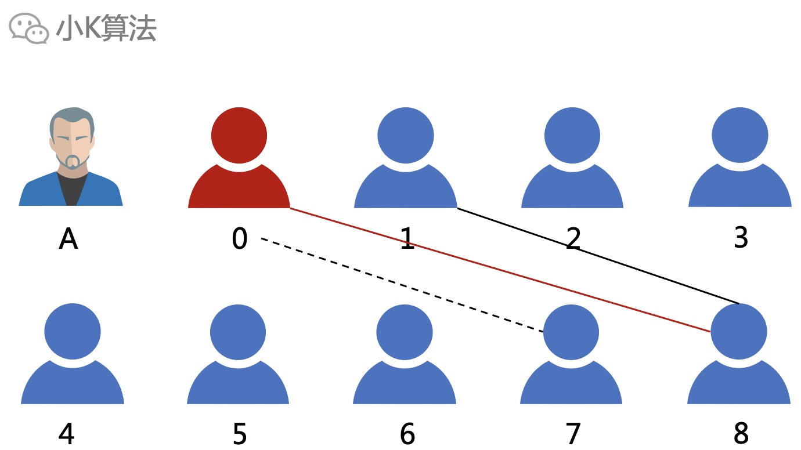

可上面得出1次的也没和7次的握手，说明1次的和7次的也是夫妇。

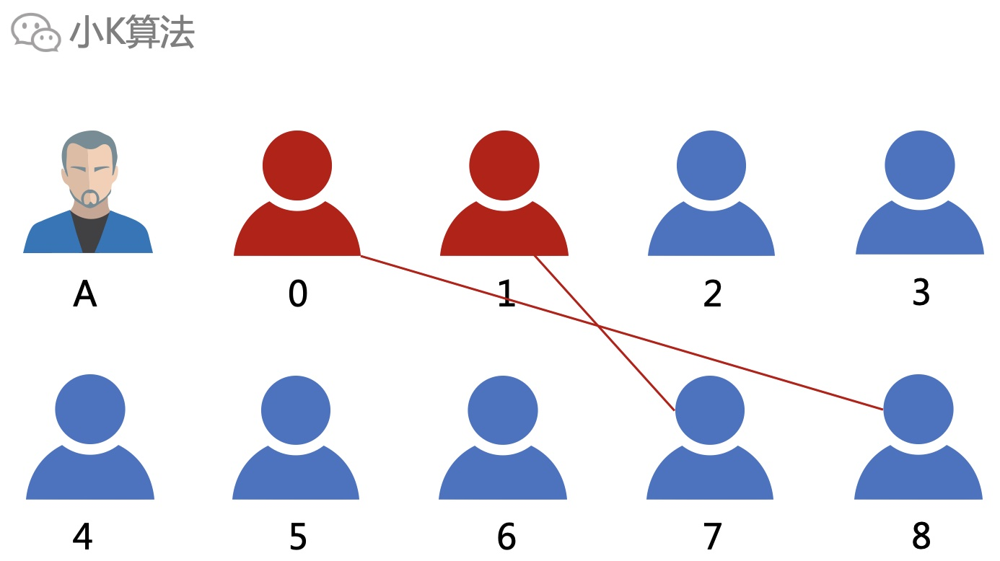

同样，2次的人是和7次、8次的握手，6次的人是没有和0次、1次的握手，所以2次和6次是夫妇。  
可以得出次数相加等于8的都是夫妇。  
最后剩下的握手4次的就是A先生的太太。

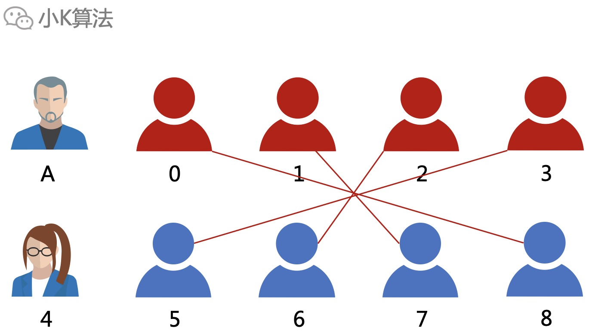

所有人的握手次数和具体情况都出来了，自然可以得出，A先生也握手4次，A先生以及他的太太都是分别和5次，6次，7次，8次的握手。

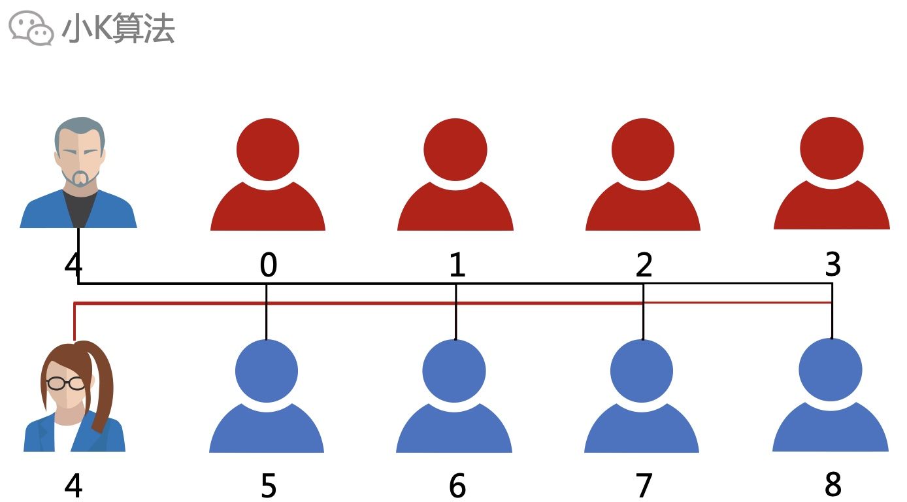

### 5 总结
这个问题的关键就在于从已知信息中，提取出背后隐含的信息，“次数不同”，往往这种看似并不突出的信息都是突破口，比如之前小K写过的一篇1+1=2，其中的“正整数”，也是整个问题的突破口，所以要善于观察分析，找到关键信息，其实问题就很简单了。

本文原创作者：小K，一个思维独特的写手。  
文章首发平台：微信公众号【小K算法】。  

如果喜欢小K的文章，请点个关注，分享给更多的人，小K将持续更新，谢谢啦！

---
**扫描下方二维码关注公众号，第一时间获取更新信息！**  

