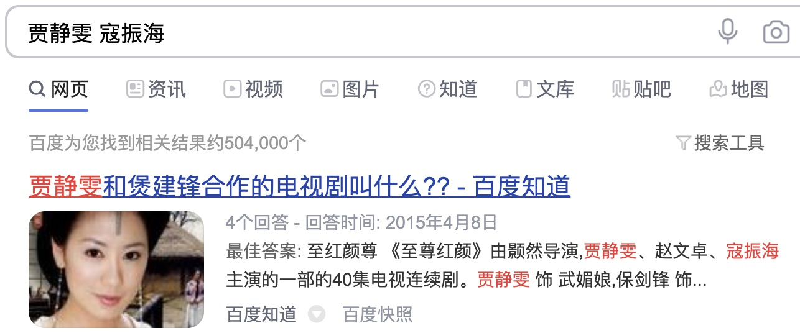
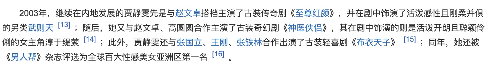
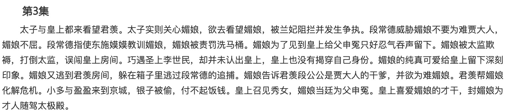

# 小姐姐说想看这个

### 1 故事起源
一天中午，在公司吃饭的时候，旁边有一个小姐姐在刷短视频，突然看到了这个视频：
<video src="img-电视剧/视频素材.mp4" controls="controls"></video>

这应该是某部电视剧的桥段，上面配有一段文字信息：“刚进宫的小宫女误把皇上当太监”。  
小姐姐突然说：这个好好看啊，我想看这个。然后看了一堆评论，也没看到电视剧的名字，有点失落。  

小K一看，嗯，是时候秀一波操作了，然后对小姐姐说：“给我5分钟”。

### 2 分析
现在我们的问题就是要用最短的时间帮小姐姐找出这段视频出自哪个电视剧。  
首先梳理目前有哪些信息：  
* 人物：宫女，皇上
* 剧情：刚进宫的小宫女误把皇上当太监
* 年代：根据服装可以推测是唐代
* 演员：因为小K几乎不看电视剧，上一次看估计还是大学的时候，再加上有点脸盲，尤其女演员感觉都长一个样，所以这两演员我都不认识。。。

接着就要通过以上信息，分析找出答案。

### 3 剧情搜索
首先最简单的肯定是直接网上搜索剧情，一搜就找到了原视频素材，以为马上就找到答案了，等我点进去的时候，并没有其它信息，于是接着往下看。

然后往下看，发现了另一条有带剧名的，《宫锁珠帘》，不过这一条小K点都没点开，直接先排除。因为这个一看是清代服装，而原视频应该是发生在唐代，所以快速跳过，不浪费时间。

不好意思，这波失误了，没有闪。不过在小K眼里，没有解决不了的问题，如果有，那一定是还在解决中，哈哈。

### 4 逆向图像搜索
接着小K要开始从演员上面下手，咱不认识没关系，搜索引擎认识就行。  
可能很多人都不知道，现在的搜索引擎都有一个功能，叫“逆向图像搜索”，就是直接通过图片搜索相关信息。  

搜索引擎输入框后面有一个小相机图标，可以上传要搜索的图片。

然后我们从视频中截取两张人物信息进行逆向图像搜索。  
男主叫寇振海。去百科查看了个人简介，代表作太多，没看出是哪一部。后面才知道他的介绍里面还真没有提到原剧。

女主叫贾静雯。百科扫了一眼，也无法快速确定是哪一部。

那就再通过两个人物进行组合搜索，结果中第一条出现的是他们合作的，很像正确结果。

### 5 验证
再次查看贾静雯个人档案，看到是2003年出演的《至尊红颜》，她饰演了武则天。根据最开始的分析，发生在唐代，这个符合，而小宫女，也符合武则天的经历，到这里基本可以确认。

再进入《至尊红颜》简介查看剧情，在第3集的地方，找到了符合视频中的剧情。

最后一步就是进入视频网站找到第3集，进行最后的确认。在18分钟左右，找到了原视频片段，完美，现在小姐姐可以开开心心的刷剧了。

### 6 总结
不论是啥问题，只要思路清晰，就有解决方法。分析信息，大胆推测，小心求证，这套方法很重要。另外一个知识点，就是图像也可以进行逆向搜索，有时对于解决问题会有意想不到的收获。  
以后大家如果看到某个短视频，想知道出自哪部剧就可以通过上面的方法来解决，当然能通过评论找到答案也是最快捷的一种方法。

本文原创作者：小K，一个思维独特的写手。  
文章首发平台：微信公众号【小K算法】。  

如果喜欢小K的文章，请点个关注，分享给更多的人，小K将持续更新，谢谢啦！

---
**扫描下方二维码关注公众号，第一时间获取更新信息！**  

