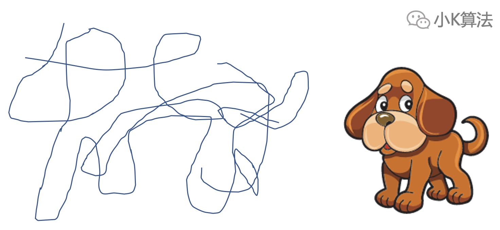

# 逻辑是怎样炼成的？

### 1 故事起源
假设现在有下面三个问题，你觉得它们有没有什么共同点？

我猜你应该觉得没有共同点，甚至是毫无关联，没关系，我们接着往下看。

### 2 抽象逻辑
到底什么是抽象，什么是逻辑？  
#### 2.1 抽象
先看一下这个图，你觉得是什么？

如果这样，它像不像一条狗呢？

抽象就是找出本质的共同特征，把一个东西想像成另一个东西。上面的过程就是抽象的过程。

#### 2.2 逻辑
那如果我问你上面的这个线条是怎么画出来的呢？

其实这就是由3个一笔画的线条拼起来的。  
逻辑其实是一种规律或者规则，可以是自己定义的，只要它符合定义的边界划分。上面用不同的线条，把一个整体拆分成小的部分，这就是一种逻辑。

#### 2.3 作用
抽象能力用于问题建模，逻辑能力用于推理。这些能力强的人，可以看到其他人看不到的一些信息，说它是一种超能力也不为过。

### 3 回到开局的问题
那之前的3个问题有没有共同点呢？或者说能不能找出一种特征，抽象成一个统一的模型？

假设我们建造了一个万能机器，它可以解决所有的问题，只要输入一些相关的信息，就可以得到想要的结果。  那么建造机器的过程就是抽象建模的过程。

那怎么让它运转呢，当然它不是烧油的，是烧脑的，所以就要用逻辑能力来驱动它正常运转。

其实所有的问题都可以应用这种统一的模型。  
聪明的同学应该已经发现了，这在数学中其实就是一个函数，建模也就是找出这个函数。

到这里，我想你肯定会问，那怎么建模呢，问题各种各样，怎么才能建造出能解决对应问题的模型？  

**划重点：**  
其实小K在思考问题时，一般都不是直接从建模的地方下手。机器有可能很复杂无法快速构建，如果你见过类似的当然可以直接套用，对于陌生的问题，在所有人看来都是一个黑盒，并不清楚内部的结构。  
所以更多时候都是从已知的信息开始，一步一步的推出内部结构。

那要怎么推呢？  
首先要了解如何解读已知信息。这就要提到生物中常用的**对照实验法**，以及物理中常用的**控制变量法**，欲知详情，且听我慢慢分解。

### 4 对照实验法
比如想研究影响小树苗成长的因素有哪些？  
光照应该对于小树苗成长有影响，那就进行两组对照实验，一组有光照，一组无光照，经过一段时间观察不同组小树苗的成长情况。  
如果生长情况相同，就说明光照没有影响，如果不同就说明光照有影响。

影响小树苗成长的因素有可能不只光照，也许还有其它的因素，比如水分。  
这时的对照实验，就要先保证两组有相同的光照，然后一组水分充足，一组水分不足。经过一段时间观察不同组小树苗的成长情况。  
如果生长情况相同，就说明水分没有影响，如果不同就说明水分有影响。  

需要注意的就是，如果有多个影响因素，要保证除研究的因素外，其它的条件都相同，否则无法确定不同结果是哪个因素导致的。  

那这个思想对于我们的逻辑有什么用呢？  
每个问题都会有多个已知条件，到底哪些才是真正能够影响问题的，就可以通过类似的方法进行思想实验。比如更改一些条件，看会不会引起问题的本质变化，这样可以帮助我们梳理出关键信息，屏蔽其它的干扰信息，从而减小分析的难度。

### 5 控制变量法
上面的方法是研究不同的因素对于问题的影响，接着就要研究同一个因素，不同量对于问题的影响，这在物理中经常运用。  
假设要研究电流与电压之间的关系，可以先固定电阻不变，然后增大或者减小电压，观察电流的变化。发现电流与电压的变化成正比，如此就可以推断出电流与电压之间的关系。

那这个思想对于我们的逻辑又有什么用呢？  
回看上面提到的统一模型中的万能机器，机器内部是一个黑盒，推断内部结构时，就可以通过改变外部的条件，观察输入与输出之间的变化。多尝试改变几次就可以大概感觉出之间的关系了，当然这里更多的也是进行思想实验。

### 6 总结
整个问题建模的过程其实并不是一步到位，都是通过已知信息先得到一个初步的结论，然后再通过上一局的结论进而推出下一步的结论，再经过多次分析推断才能最终得到想要的结果。  
人的大脑在识别信息时也是一层一层的分析，现在的神经网络算法就是参考人的大脑的分析过程。

上面介绍的几种不同的思维方式主要是帮助大家思考，遇到问题时可以尝试不同的角度去分析，但具体的问题还是要具体分析，没有统一的模型可以直接套用。

本文原创作者：小K，一个思维独特的写手。  
文章首发平台：微信公众号【小K算法】。  

如果喜欢小K的文章，请点个关注，分享给更多的人，小K将持续更新，谢谢啦！

---
**扫描下方二维码关注公众号，第一时间获取更新信息！**  

