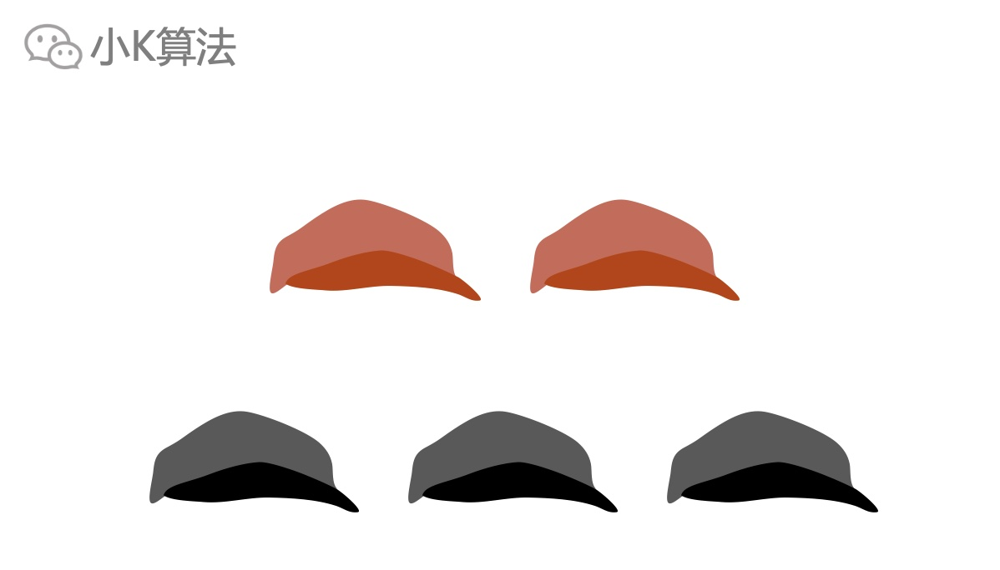
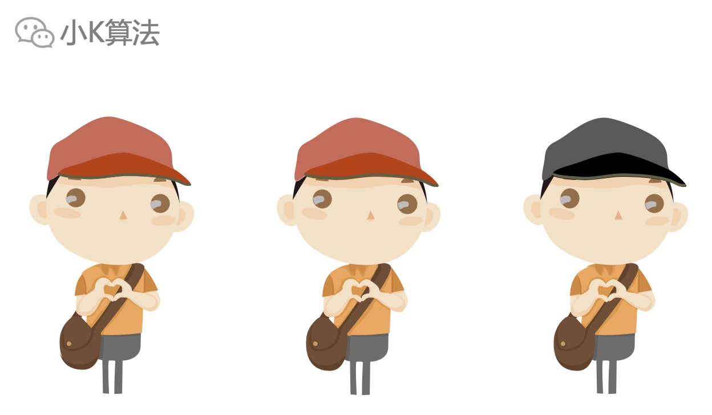
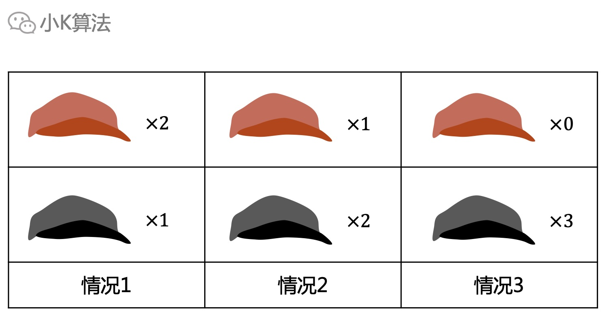
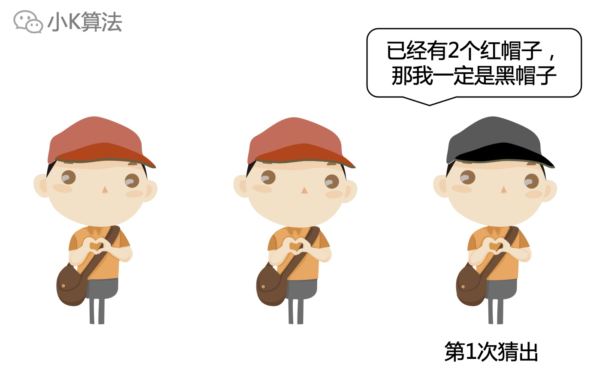
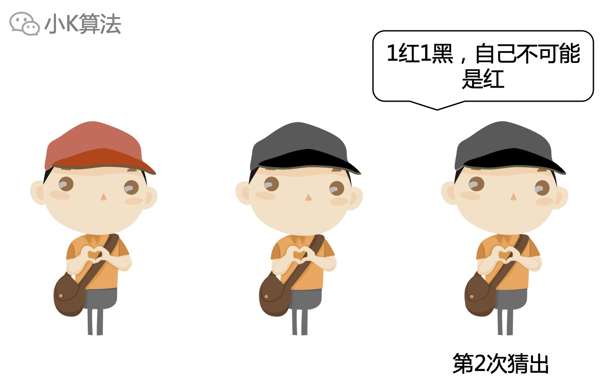
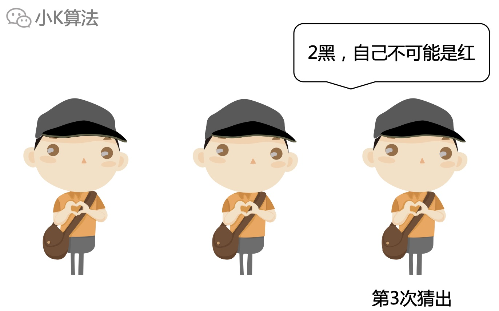

# 逻辑面试题：叫你戴帽子

### 1 故事起源
有2个红帽子和3个黑帽子。

老师给3个学生任意选择一顶帽子戴上。

每个人能看到别人的帽子，但看不到自己的帽子。现在老师问，你们知道自己帽子的颜色吗？
第一次没人回答。  
老师问第二次，还是没人回答。  
老师再问第三次，所有学生同时说出了自己帽子的颜色。请问你知道他们戴的什么帽子吗？

### 2 分析
数据规模很小，可以采用枚举法，直接枚举所有的情况。总共3个学生，可能的情况如下：

#### 2.1 情况1
对于黑帽子的同学，因为他看到2个红帽子，而总共5个帽子中也只有2个红帽子，那推断自己肯定就是黑帽子了，老师在第一次询问的时候就会有人回答。  
但第一次没人回答，也就排除了该情况。

#### 2.2 情况2
对于黑帽子的同学，他看到1红1黑，那自己要么是红，要么是黑。如果自己是红帽子，就变成了2红1黑，那在第1次的时候就应该有人回答，但第1次没人回答，说明自己不是红。所以在第2次的时候，黑帽子可以推断出自己的帽子，但第2次也没人回答，说明排除该情况。

#### 2.3 情况3
每个同学都看到2个黑帽子，自己也只有2种情况，要么红帽子，要么黑帽子。如果自己是红帽子，那就变成1红2黑，根据上面的推断，这种情况会在第2次被人猜出，但第2次没人回答，说明自己不是红帽子，那自己只能是黑帽子。所以在第3次，3人同时回答自己戴的黑帽子。

结论就是3个学生戴的都是黑帽子。

### 3 总结
这个逻辑推理还算是比较简单的，因为数据规模很小，可以用枚举法列出所有的情况，再一一排除。如果数据变大，方法也是一样的。之前还写过一篇帽子推理的问题，[红帽子与黑帽子](/logic/2021/4/帽子.html)， 问题类似，但没有给总数，是通过轮次推断帽子数量，其实思考方法还是一样的，有兴趣的同学可以再研究一下。

本文原创作者：小K，一个思维独特的写手。  
文章首发平台：微信公众号【小K算法】。  

如果喜欢小K的文章，请点个关注，分享给更多的人，小K将持续更新，谢谢啦！

---
**扫描下方二维码关注公众号，第一时间获取更新信息！**  

