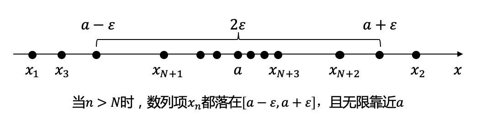

# 0.9循环等于1吗？

>[!TIP|style:flat|label:问题引入]
>**$$0.\dot{9}=1$$吗？**  
>看似一个简单的问题，但不一定能讲出为什么，今天我们来尝试用科学的姿势研究一下。  
>内容不难，主要是分享怎么用数学语言去描述问题的本质。

**普通青年：**    
小学问题，别来烦我，你数学是体育老师教的？  
设$$x=0.\dot{9}$$，则$$10x-x=9$$，进而$$x=1$$。  
**文艺青年：**  
数轴是连续的，如果$$0.\dot{9}\neq 1$$，则存在一个数$$x,0.\dot{9}< x < 1$$，但我也找不到这个$$x$$啊，好烦呀。    
**2B青年：**  
因为$$0.\dot{3}=\frac{1}{3}$$，所以$$0.\dot{3}\times 3=0.\dot{9}=\frac{1}{3}\times 3=1$$。好像也很有道理呀，我竟五体投地。  

**热身完成，进入正题，先来复习一下高等数学相关的知识吧！**  
> [!TIP|style:flat|label:数学符号含义]
> $$\forall$$：对于任意给定的，$$\exists$$：存在

### 1.数列定义
按照某一法则，对每个$$n\in N_+$$，对应一个确定的实数$$x_n$$，所有$$x_n$$按下标$$n$$从小到大排列得到一个序列  
$$x_1,x_2,x_3,\cdots,x_n,\cdots$$  
称此为**数列**，简记为数列$$\{x_n\}$$。  
每一个数叫做数列的**项**，第$$n$$项$$x_n$$叫做数列的**一般项**(通项)。

### 2.数列极限定义
设$$\{x_n\}$$为一数列，如果$$\exists a, \forall \epsilon$$(不论多小)，总存在正整数$$N$$，使得当$$n>N$$时，不等式  
$$|x_n-a|<\epsilon$$都成立，  
则称常数$$a$$是**数列$$\{x_n\}$$的极限**，或者称数列$$\{x_n\}$$**收敛于**$$a$$，记为  
$$\lim\limits_{n\to\infty} x_n=a$$，或$$x_n \rightarrow a(n \rightarrow \infty)$$。  
如果不存在这样的常数$$a$$，就说数列$$\{x_n\}$$没有极限，或者说数列$$\{x_n\}$$是**发散**的。  
**几何含义如下：**

### 3.证明
设数列$$\{x_n\},x_n=1-10^{-n}$$，即数列为$$0.9,0.99,0.999,\cdots,0.\dot{9},\cdots$$  
$$|x_n-1|=10^{-n}$$，  
$$\forall \epsilon>0$$，为了使$$|x_n-1|<\epsilon$$，只要$$10^{-n}<\epsilon$$  
取对数得$$\lg 10^{-n}<\lg \epsilon$$，即$$n>-\lg \epsilon$$，  

而$$-\lg \epsilon$$是一个确定的实数，对于任何一个实数都有无穷多个大于它的正整数存在，所以任取一个大于$$-\lg \epsilon$$的正整数作为$$N$$，则当$$n>N$$时，就有  
$$|x_n-1|<\epsilon$$，  
即  
$$\lim\limits_{n\to\infty} 1-10^{-n}=0.\dot{9}=1$$  
说人话，数列的极限是$$1$$，或者说数列收敛于$$1$$。  

**参考文献**
1. 《高等数学》，同济大学数学系编，高等教育出版社，1978；

---
**扫描下方二维码关注公众号，第一时间获取更新信息！**  

