# 鸡兔同笼问题

### 1 故事起源
有若干只鸡和兔在一个笼子里，从上面数有35个头，从下面数有94只脚。问笼中各有多少只鸡和兔？

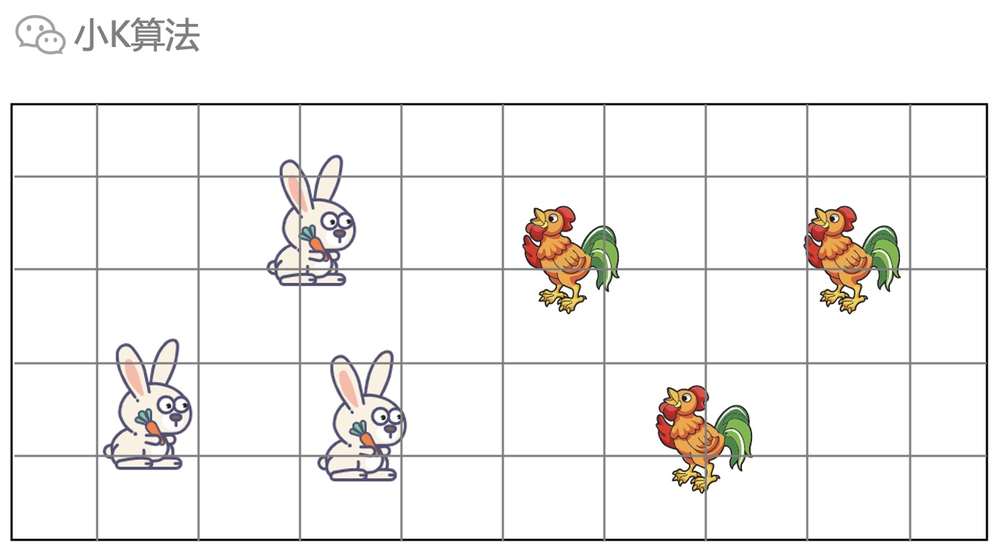

### 2 分析
先假设有x只兔子，y只鸡。  
则根据头的数量可得到一个信息：x+y=35。

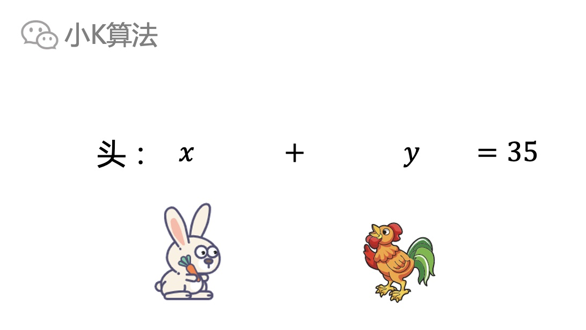

再根据脚的数量可得到一个信息：4x+2y=94。

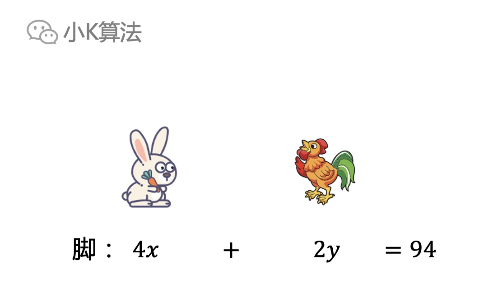

于是我们把这个问题就变成了一个初中数学问题，即二元一次方程求解。

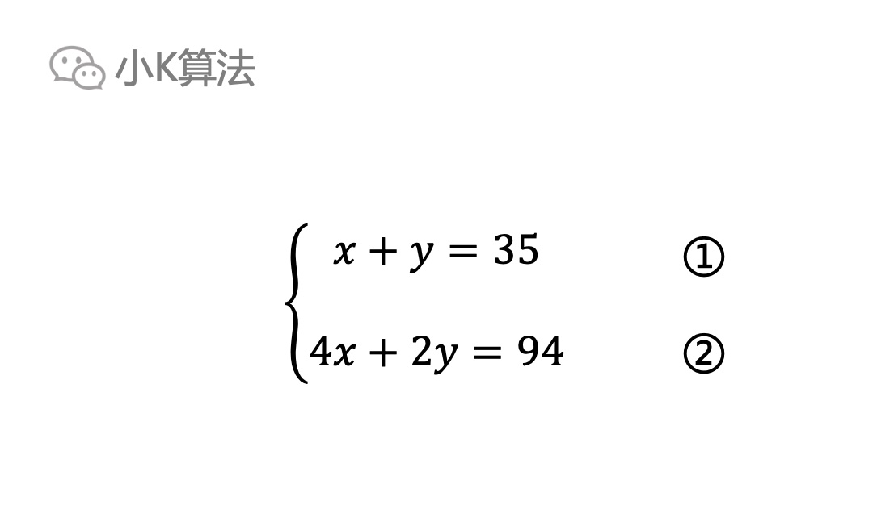

求解过程也比较简单，通过变形即可。

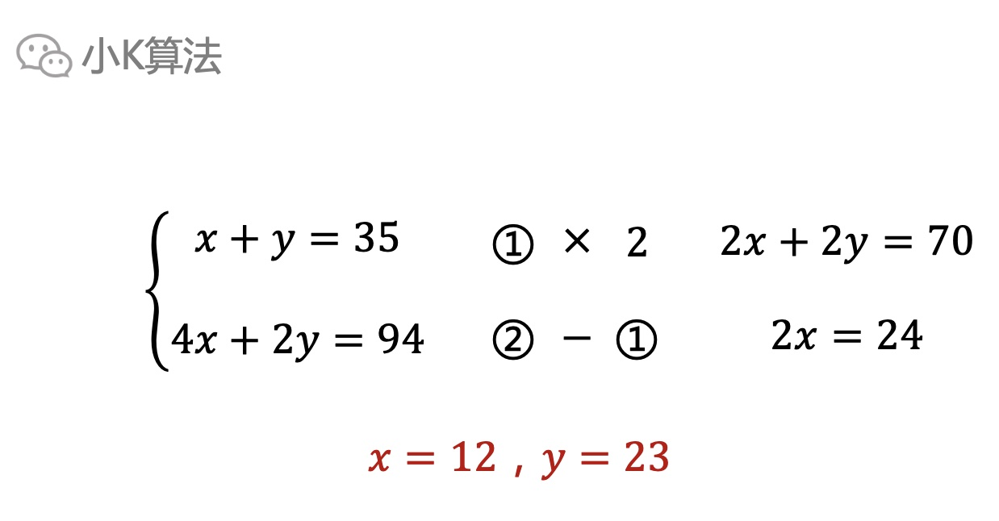

生活中有很多的问题都可以演变成一个方程求解，比如一般的情况如下。

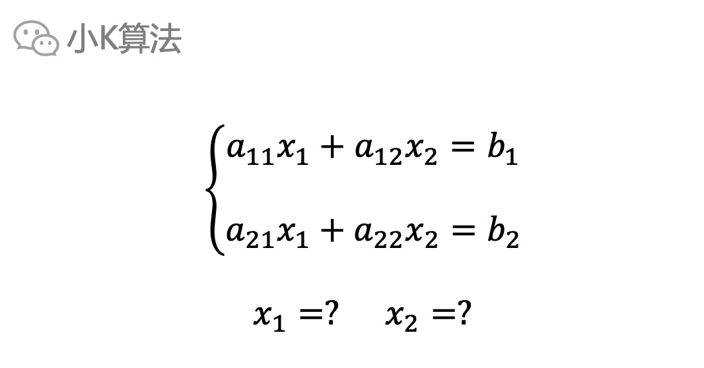

那有没有快速求解的方法呢？作为一个大学生，肯定要用一些更高级的方法啦，哈哈。

### 3 方程求解
从上面可以得出通过消元减少未知数，为消去x2，以a22与a12分别乘上两式，然后相减得到下式。

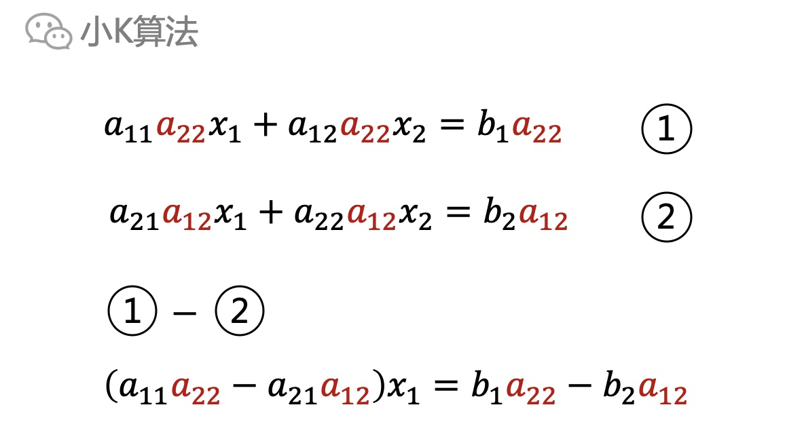

同理为消去x1，可得到下式。

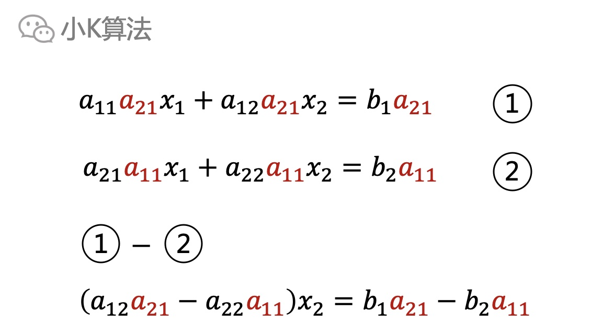

然后就得到了一般解。

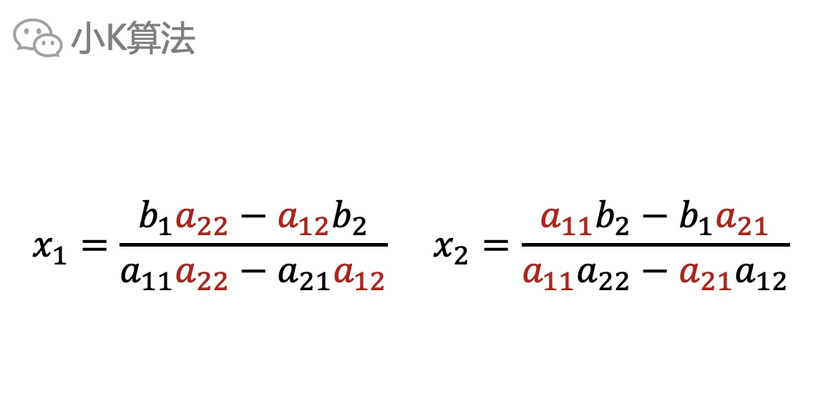

不难发现x1和x2的分母都是一样的，而且只有左边的系数，那能否把这个规律更加通俗易懂的总结一下呢？这就要说到大学中一个非常重要的知识，**行列式**。

### 4 行列式
先把系数和未知数分离开。

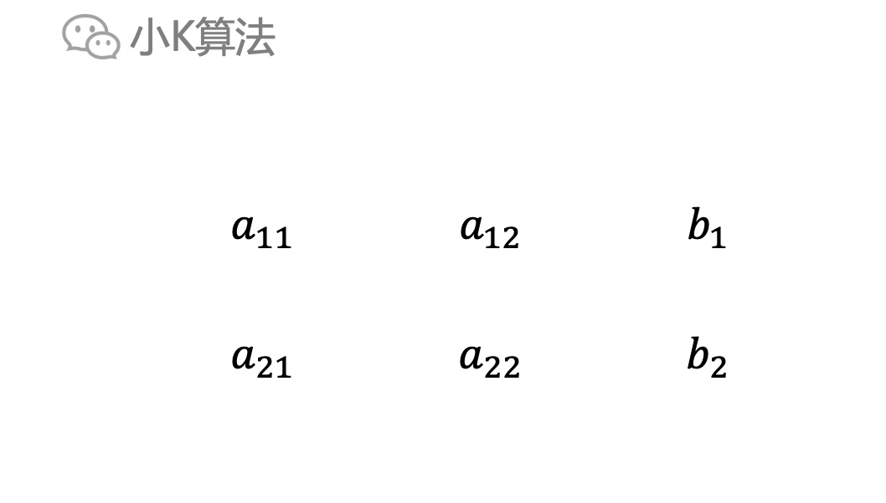

对一个2行2列的矩阵定义这样一种运算规则，交叉相乘再相减，这就叫作**二阶行列式**。

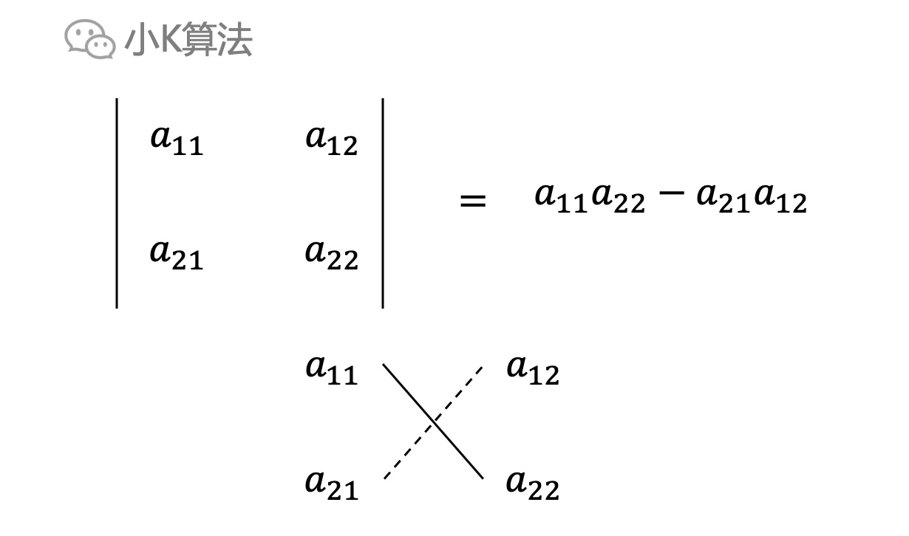

实线为**主对角线**，虚线为**副对角线**，即主对角线之积减去副对角线之积。

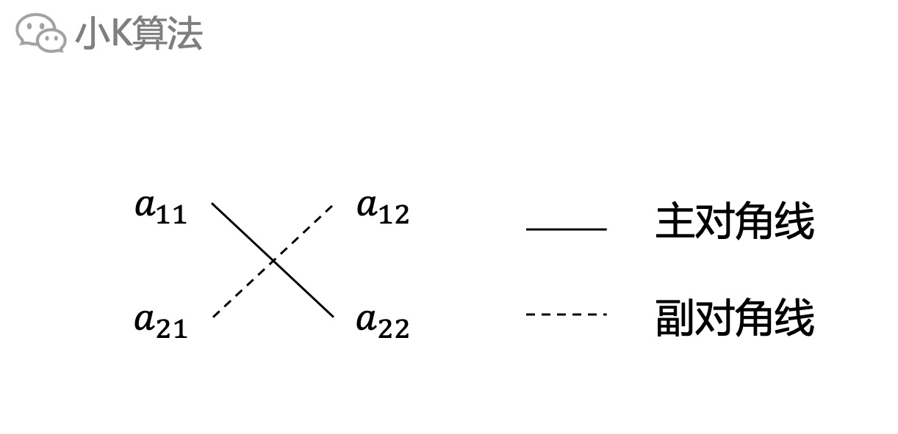

同样x1和x2的分子也可以用二阶行列式表示。x1的分子是用b1,b2替换第1列，x2的分子就是用b1,b2替换第2列。

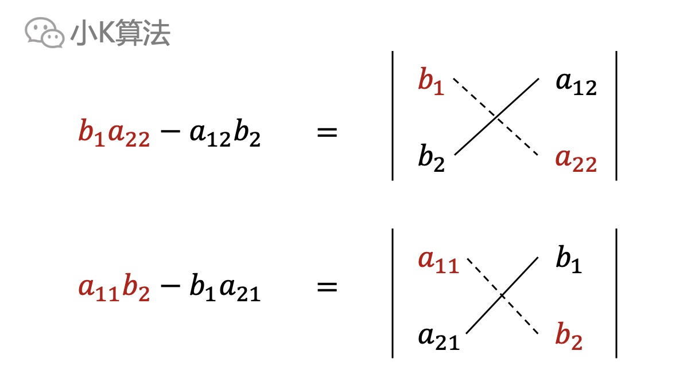

则x1和x2就可以用二阶行列式表示出来。

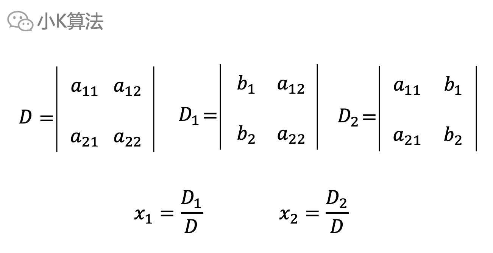

好了，现在我们已经学会了用二阶行列式解二元一次方程啦。

### 5 应用
现在我们用行列式来解文章开头的方程，先计算对应的3个行列式。

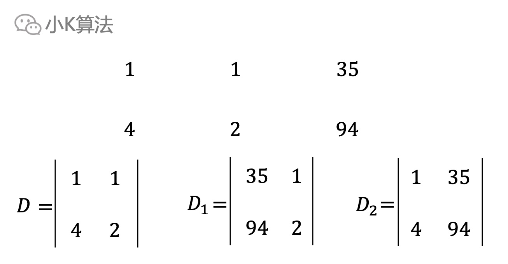

再通过上面的值求出未知数。

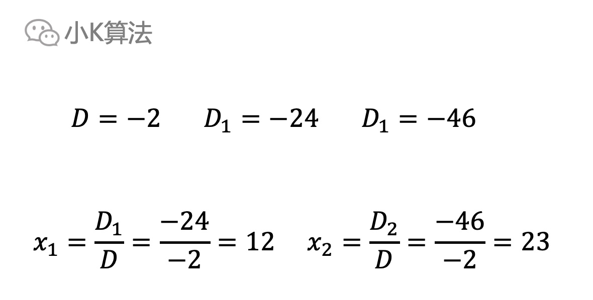

是不是感觉方便多了，知识就是力量啊，高等数学果然不一样。小学生都可以学会的技能，可以广泛的应用到生活中。

我猜肯定有同学会问，如果有3个未知数甚至更多怎么办呢，有没有3阶行列式，n阶行列式呢？答案肯定是有的啊，非大学与大学数学知识最大的一个区别就是推广，大学以下只教你1，2，3，大学以上教你m，n，至于m，n到底是啥，且听下回分解。

### 6 总结
数学知识真的非常重要，但在学校那会单纯的学习1+1=2真的枯燥和乏味，如果结合生活中的应用场景，就会变得很有意思了，所以后面我会陆续把能应用的数学知识都通过生活场景分享给大家，希望大家有所收获，谢谢大家的支持与关注。

本文原创作者：小K，一个思维独特的写手。  
文章首发平台：微信公众号【小K算法】。  

如果喜欢小K的文章，请点个关注，分享给更多的人，小K将持续更新，谢谢啦！

---
**扫描下方二维码关注公众号，第一时间获取更新信息！**  

