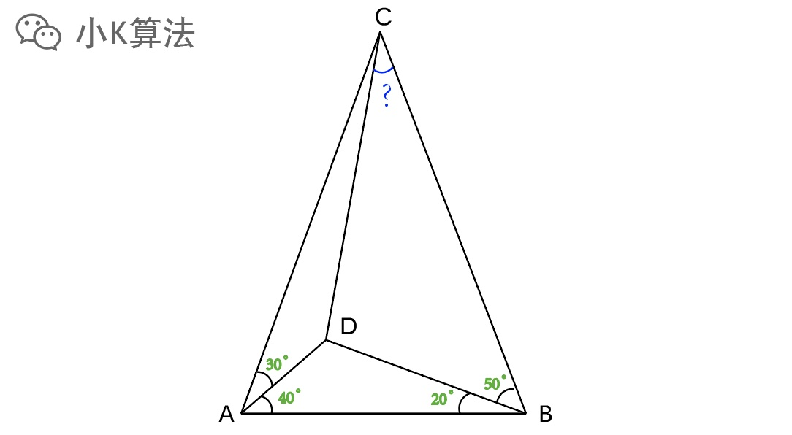
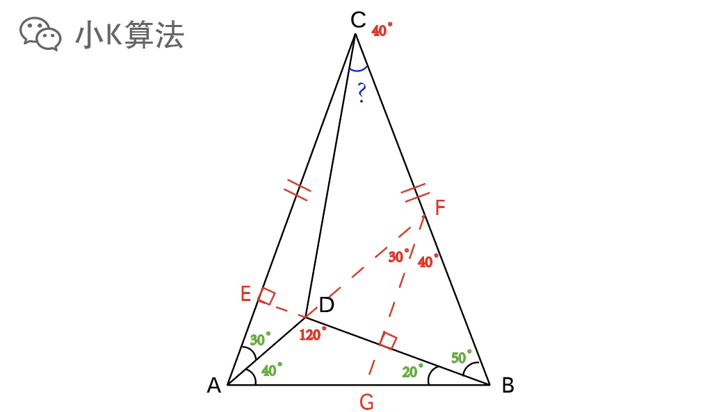
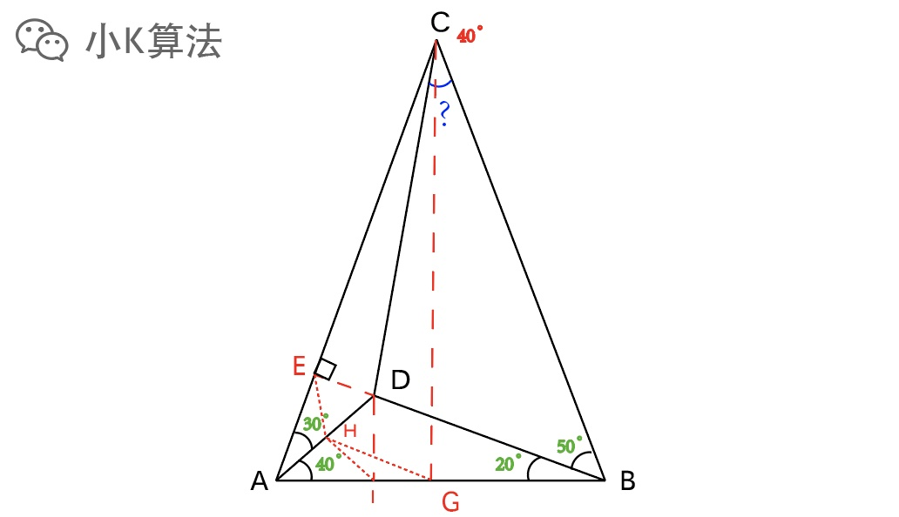
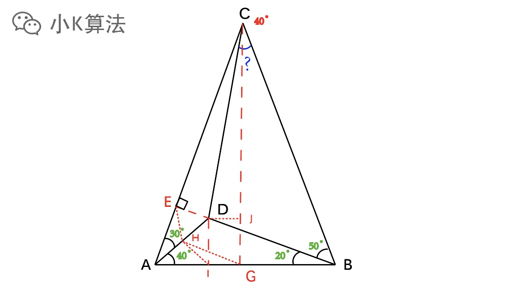

# 一道看似简单的初中平面几何题

### 1 故事起源
偶然间看到了一道初中平面几何题，感觉很简单，2分钟秒杀应该问题不大。微积分也许我唯唯诺诺，初中数学还不得重拳出击啊。

如下图，其中已知的角度已标明，求角BCD多少度？

### 2 分析
已经给出了4个角度，所以先把能求的信息全部求出来。  

* 角CAB=角CBA=70度，可知为等腰三角形。
* 延长BD与AC相交于E，可知BE垂直AC。  
* 延长AD与BC相交于F，可知AFB为70度，则AFB也为等腰，且与CAB相似。
* 通过F作FG//AC，FG与AB相交于G，可知FGB也相似CAB。

到这里感觉马上就要出来了，不过好像还是差了一点点。。。  
别怀疑你的智商，2分钟秒杀还是不太现实的，硬实有点难度啊，哈哈。  

### 3 非主流思考
通过严谨的逻辑+推理，貌似并不能得到结果，那就换个思路。  

比如我问你：角BCD的范围大概是多少度，你能感觉出来吗？  

ACB=40，所以BCD肯定是小于40的。CD偏左一点，所以BCD肯定大于ACB的一半，即大于20，如果是中考，我可能会直接填上30度，别问为什么，问就是直觉，你信不，哈哈。  

那到底BCD会不会真是30度呢？肯定不会是28.5度或者33.7度吧，那不然这个出题的老师就太坑了，得上正余弦硬解方程了。

###  4 特殊信息
角度信息已经利用完了，但没有得到结果，接下来要思考能不能利用边的信息。边是可以等比缩放的，所以边只考虑比例，而不是具体的值。  

边肯定与角度相关，比如一些特殊角，30，45，60度等。我们可以看到图中出现了30度，那就尝试转化成边的信息继续思考。

作AD中点H，连接EH，EHD为等边三角形。作DI垂直AB，HD=HI=AH，所以角HIA=40度。  

因为H是中点，且CAB是等腰三角形，可以再作AB的中点G，连接CG，HG。  
HG//BD，所以角HGI=20度，因为上一步得出HIA=40度，所以HIG也是等腰三角形。  

此时得到ED=HD=HI=IG。  

可以再作DJ垂直CG，与CG相交于J点，所以DIGJ是一个矩形，即DJ=IG。再结合上一步信息，得出ED=DJ，所以CD是角ECJ的角平分线，因为ECJ=20度，所以角ECD=10度，所以BCD=30度。

### 5 总结
几何解法非常漂亮，但很难想到，辅助线非常关键，方向不对容易一条路走到黑。可以多尝试几种不同的辅助线作法。如果还是不行，那最后一招就是用正余弦定理直接解方程，这个我想大家应该都会吧，那就不再举例了，哈哈。

本文原创作者：小K，一个思维独特的写手。  
文章首发平台：微信公众号【小K算法】。  

如果喜欢小K的文章，请点个关注，分享给更多的人，小K将持续更新，谢谢啦！

---
**扫描下方二维码关注公众号，第一时间获取更新信息！**  

