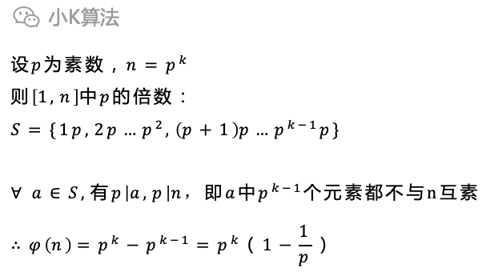

# 如何快速求与n互素的数有多少

### 1 故事起源
一个数n，在小于等于n的正整数[1,n]中，与n互素的数有多少个呢？  
(注：x与n互素，说明x与n的最大公约数为1)

<div align=center></div>

### 2 分析
最直观的方法当然就是直接枚举所有小于n的数，再通过求最大公约数判断即可。  
但当n很大的时候，这个方法就不优了。可能有同学已经发现了，这个不就是欧拉函数的定义吗，所以今天我们从数学上来分析如何快速求解。

### 3欧拉函数
欧拉函数定义如下：
<div align=center></div>

欧拉函数具有几个优秀的性质，先介绍几个常用的数学符号，便于描述。
<div align=center></div>

#### 性质1
当n为素数时，很明显phi(n)=n-1，因为所有小于n的数都与n互素。
<div align=center></div>


当n为某个素数p的幂次时，即n=p^k，则与n不互素的一定为p的倍数。  

[1,n]中p的倍数一共有p^(k-1)个，所以互素的即为总数减去不互素的个数。
<div align=center></div>

#### 性质2
欧拉函数是一个积性函数，当整数m,n互素时，phi(mn)=phi(m)\*phi(n)。
<div align=center></div>

这个性质的证明需要用到同余和集合相关的定理，有点复杂，以后写同余相关的知识再专门分享如何证明，现在就先记住这个性质就行了。


### 4 计算
有了这2个性质就可以推导出欧拉乘积公式。
<div align=center></div>

接下来就只需要考虑如何对n进行质因素分解。

最简单的方式可以直接枚举，先找到最小的质因子p1，然后除去所有p1因子，再对剩余的数继续分解。
<div align=center></div>


### 5 代码实现
```cpp
int euler_phi(int n) {
    int m = sqrt(n + 0.5);
    int ans = n;
    for (int i = 2; i <= m; ++i) {
        if (n == 1) break;
        if (n % i == 0) {
            ans = ans / i * (i - 1);
            while (n % i == 0) n /= i;
        }
    }
    if (n > 1) ans = ans / n * (n - 1);
    return ans;
}
```

### 6 总结
现在的算法复杂度主要取决于寻找第一个质因子，枚举并不是最快的方法，更快的方法是基于费马小定理，miller_rabin，pollard_rho等原理的随机化算法。  

数论是一个大类，在很多地方都有重要的应用，而素数在密码学中应用也很广泛，今天分享的算是数论入门的一个介绍，后面还会分享更多有关数论的知识。

本文原创作者：小K，一个思维独特的写手。  
文章首发平台：微信公众号【小K算法】。  

如果喜欢小K的文章，请点个关注，分享给更多的人，小K将持续更新，谢谢啦！

---
**扫描下方二维码关注公众号，第一时间获取更新信息！**  
<div align=center></div>