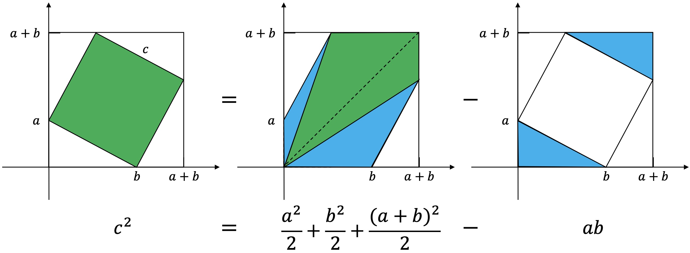

# 勾股定理竟然有500种证明方法，你会几种？

### 1 介绍
一个直角三角形，短的直角边叫勾，长的直角边叫股，斜边叫弦。勾的平方加股的平方等于弦的平方，所以称之为勾股定理。

### 2 商高提出
根据《周髀算经》记载，公元前1000年，商高(西周初数学家)与周公(名旦，姬昌第四子，儒学先驱)的对话中，首次提出了勾股定理。  
《周髀算经》原文记载：
>“若求邪至日者，以日下为勾，日高为股，勾股各自乘，并而开方除之，得邪至日。”

### 3 毕达哥拉斯提出
公元前6世纪，古希腊数学家毕达哥拉斯，提出了勾股定理，但证明方法已失传。所以西方多称这个定理为毕达哥拉斯定理。
    
### 4 欧几里德证明
公元前4世纪，古希腊数学家欧几里德，在《几何原本》中明确证明了勾股定理。  
说明：同底等高的长方形面积是三角形面积的2倍，如下同色块的面积是相等的。

### 5 赵爽证明
三国时期吴国数学家赵爽，在《周髀算经》的注释中记载“勾股各自乘，并之为玄实，开方除之即弦”。
并通过“勾股圆方图”证明了勾股定理。  
说明：大正方形的面积等于4个直角三角形加上一个小正方形面积之和。

### 6 爱因斯坦证明
爱因斯坦在11岁时获得了一本几何书，有一天叔叔给他讲勾股定理时，他觉得证明太复杂，于是就自己想了一种方法来证明。  
说明：三个直角三角形相似，那么该三角形的面积与以斜边构成的正方形面积之比固定。

### 7 加菲尔德证明
加菲尔德在1880年当选美国第20任总统，他在五年前证明了勾股定理，因此也称这个证明方法为“总统证法”。  
说明：梯形面积等于3个直角三角形的面积之和。

### 8 小K证明
通过相似三角形，边长之比相等，证明了勾股定理。

### 9 图形拼接证明
一切尽在不言中，别说话，看图。

### 10 辅助圆证明
以点B为圆心，BA为半径作圆，延长BC交圆于点E,D，则三角形DCA相似ACE。

### 11 切割定理证明
直角三角形ABC，以点B为圆心BC为半径作圆，交AB及AB延长线于D,E，则BE=BC=BD=a。

### 12 面积合成证明
一切尽在不言中，别说话，看图。

### 13 行列式证明
二阶行列式公式：$$\left|\begin{array}{cccc}a&b\\c&d\end{array}\right|=ad-bc$$。  
说明：二阶行列式等于以两个向量$$\begin{pmatrix}a\\c\end{pmatrix},\begin{pmatrix}b\\d\end{pmatrix}$$为边张成的四边形的面积。  
推广：n阶行列式就等于以n个向量为边在n维空间中张成的n维体的体积。(以后我会专门写一篇n维空间的文章)

### 14 无穷级数证明
根据极限定理，有$$1+x+x^2+\cdots+=\frac{1}{1-x},x<1$$。  
根据如下图先得到$$h=\frac{ab}{c}$$。

然后通过如下图的无限划分，得到$$b_1=\frac{a^2b}{c^2}$$。

再通过如下图得到$$\frac{b_n}{b_{n-1}}=\frac{a_n}{a_{n-1}}=\frac{b^2}{c^2}$$。

最后通过如下运算证明勾股定理。

### 15 鞋带公式证明
Shoelace公式，也叫高斯面积公式，用于求多边形面积。因为计算的时候交叉相乘像系鞋带一样，所以叫鞋带公式。   
由N个顶点围成的多边形，顶点分别为$$A_1,A_2,A_3\cdots,A_n，A_i=(x_i,y_i),i=1,\cdots,n$$，则面积为：  
$$S=\frac{1}{2} \left| \sum_{i=1}^n(x_iy_{i+1}-x_{i+1}y_i) \right|=
\frac{1}{2} \left| \sum_{i=1}^nx_i(y_{i+1}-y_{i-1}) \right|=
\frac{1}{2}\left| \sum_{i=1}^n  det \begin{pmatrix} x_i& y_i\\ x_{i+1} & y_{i+1}\end{pmatrix} \right|
$$

如果喜欢小K的文章，请点个关注，分享给更多的人，小K将持续更新，谢谢啦!  

---
**扫描下方二维码关注公众号，第一时间获取更新信息！**  

