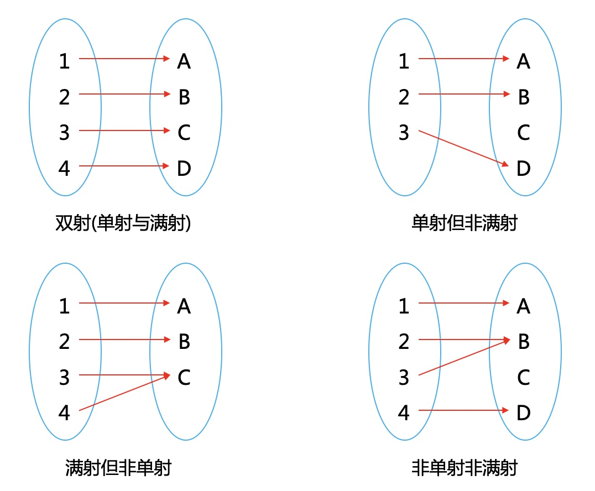
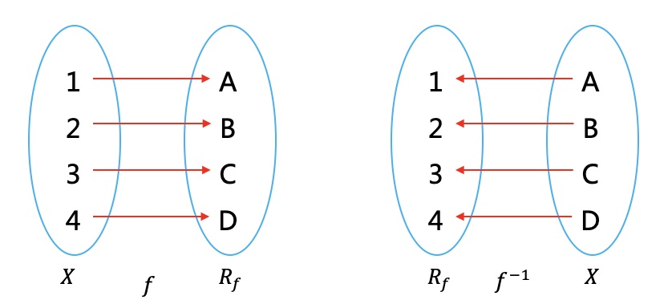
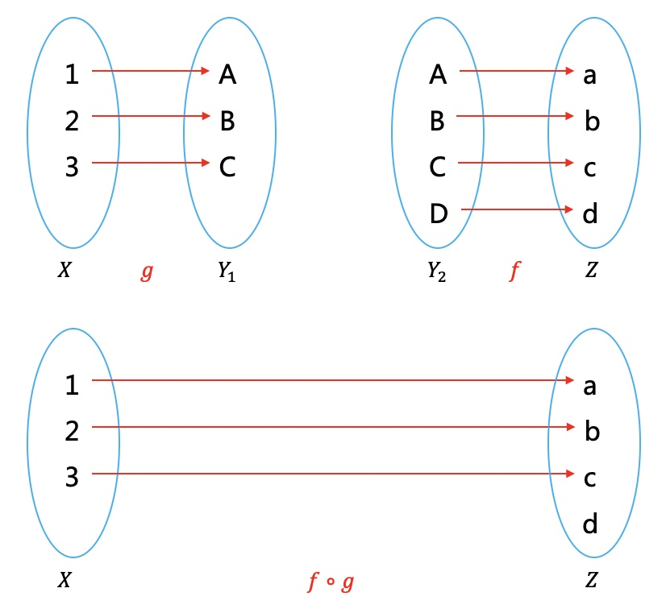
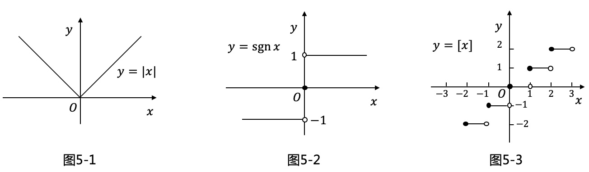
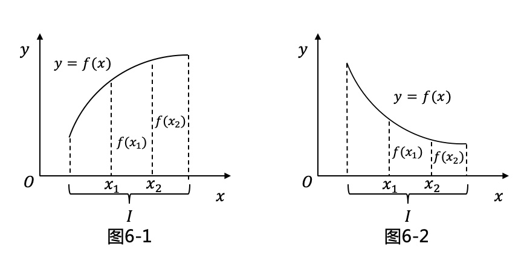
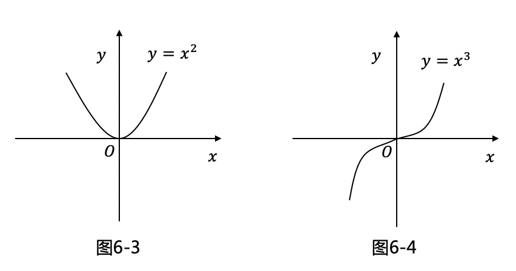
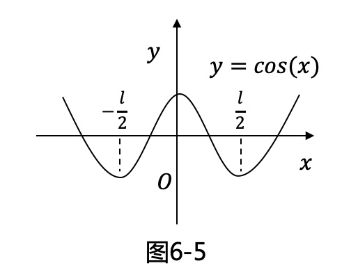

# 映射与函数

### 1.映射
$$X,Y$$为非空集合，如果存在法则$$f$$，对$$X$$中每个元素$$x$$,$$Y$$中有唯一元素$$y$$与之对应，则称$$f$$为从$$X$$到$$Y$$的**映射**,  
记作$$f:X \rightarrow Y$$，  
$$y$$称为$$x$$的像，并记作$$f(x)$$，即$$y=f(x)$$，$$x$$称为$$y$$的原像。  
$$X$$为定义域，记作$$D_f$$，$$Y$$为值域，记作$$R_f$$或$$f(X)$$，即  
$$R_f=f(X)=\{f(x)|x \in X\}$$。  

概念|定义
:-:|-
**单射**|$$\forall x_1,x_2\in X$$, 如果$$x_1\neq x_2$$, 则$$f(x_1)\neq f(x_2)$$
**满射**|$$\forall y\in Y, \exists x, y=f(x)$$，即至少存在一个$$x$$与$$y$$对应。
**双射**|既是单射，又是满射，则称$$f$$为一一映射(双射)。

> [!TIP|style:flat|label:数学符号含义]
> $$\forall$$：对于任意给定的，$$\exists$$：存在

### 2.逆映射
设$$f$$为单射，可定义新映射$$g$$，  
$$g:R_f\rightarrow X$$，对每个$$y\in R_f$$，规定$$g(y)=x$$，这$$x$$满足$$f(x)=y$$。  
则称$$g为f$$的逆映射，记作$$f^{-1}$$  
其定义域$$D_{f^{-1}}=R_f$$，值域$$R_{f^{-1}}=X$$  

### 3.复合映射
设有2个映射  
$$g:X\rightarrow Y_1$$，$$f:Y_2\rightarrow Z$$，$$Y_1\subset Y_2$$  
定义一个从$$X$$到$$Z$$的对应法则，它将每个$$x\in X$$映成$$f[g(x)]\in Z$$。称该映射为$$g$$和$$f$$构成的复合映射，记作$$f\circ g$$，即  
$$f\circ g: X\rightarrow Z, (f\circ g)(x)=f[g(x)], x\in X$$  

### 4.函数
设数集$$D\subset \textbf{R}$$，则称映射$$f:D\rightarrow \textbf{R}$$为定义在$$D$$上的函数，简记为$$y=f(x),x\in D$$，  
$$x,y,D$$分别称为<u>**自变量**</u>，<u>**因变量**</u>，<u>**定义域**</u>。  
函数值$$f(x)$$全体所构成集合称为函数$$f$$的<u>**值域**</u>，记作$$R_f$$或$$f(D)$$，即  
$$R_f=f(D)=\{y|y=f(x),x\in D\}.$$
### 5.常见函数
**绝对值函数：图5-1**  
$$(1)y =|x|= \left\{ \begin{array}{l}
-x & if\ x<0\\
x & if\ x \geq 0
\end{array} \right.$$    
**符号函数：图5-2**  
$$(2)y =|x|= \left\{ \begin{array}{l}
-1 & if\ x<0\\
0 & if\ x = 0\\
1 & if\ x> 0
\end{array} \right.$$  
**取整函数：图5-3**  
$$(3)y=[x]$$   
  

### 6.函数特性
#### 6.1有界性
设函数$$f(x)$$的定义域为D，数集$$X\subset D$$。  
* 如果存在数$$K_1$$，使得对$$\forall x$$，$$f(x)\leq K_1$$成立，  
  则称函数$$f(x)$$在$$X$$上有<u>**上界**</u>$$K_1$$；  
* 如果存在数$$K_2$$，使得对$$\forall x$$，$$f(x)\geq K_2$$成立，  
  则称函数$$f(x)$$在$$X$$上有<u>**下界**</u>$$K_2$$；  
* 如果存在数$$M$$，使得对$$\forall x$$，$$|f(x)|\leq M$$成立，  
  则称函数$$f(x)$$在$$X$$上<u>**有界**</u>。  

#### 6.2单调性
设函数$$f(x)$$的定义域为$$D$$，区间$$I\subset D$$。  
* 如果对区间$$I$$中$$\forall x_1,x_2,$$，当$$x_1< x_2$$时，恒有$$f(x_1)<f(x_2)$$,  
  则称$$f(x)$$在区间$$I$$上单调增加（图6-1）。  
* 如果对区间$$I$$中$$\forall x_1,x_2,$$，当$$x_1< x_2$$时，恒有$$f(x_1)>f(x_2)$$,  
  则称$$f(x)$$在区间$$I$$上单调减少（图6-2）。

#### 6.3奇偶性
设函数$$f(x)$$的定义域$$D$$关于原点对称。  
* 如果对$$\forall x\in D$$，  
  $$f(x)=f(-x)$$恒成立，称$$f(x)$$为偶函数（图6-3）。  
* 如果对$$\forall x\in D$$，  
  $$f(-x)=-f(x)$$恒成立，称$$f(x)$$为奇函数（图6-4）。

#### 6.4周期性
设函数$$f(x)$$的定义域为$$D$$。如果存在一正数$$l$$，使得对$$\forall x\in D$$有$$(x\pm l)\in D$$，  且  
$$f(x+l)=f(x)$$恒成立，称$$f(x)$$为周期函数，$$l$$称为$$f(x)$$的周期（图6-5）。  

**参考文献**
1. 《高等数学》，同济大学数学系编，高等教育出版社，1978；

---
**扫描下方二维码关注公众号，第一时间获取更新信息！**  

